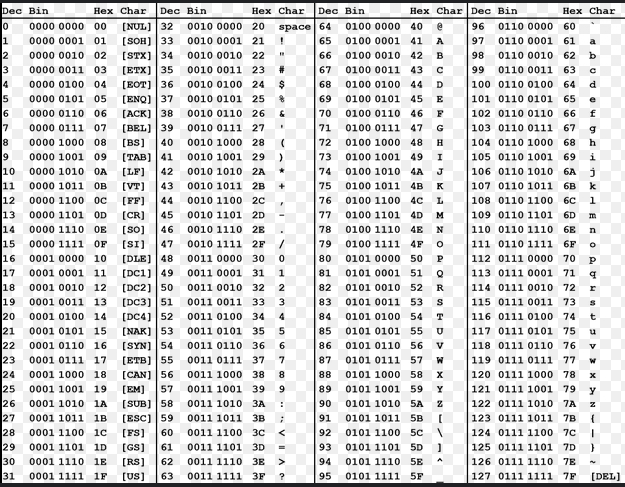

# 1.1 Ficheros
### Los **ficheros** son estructuras de información que crean los SO de los ordenadores para poder almacenar datos.Suelen tener un nombre y una extensión, que determina el formato de la informaciñon que contiene,
##  1.1.1. Tipos de ficheros y formatos
### El formato y tipo de fichero determina la forma de interpretar la información que contiene,ya que, en definitiva,lo único que se almacena en un fichero es una ristra de bits (ceros y unos), de forma que es necesaria su interpretación para dar sentido a la información que almacena.
### El  contenido  de un fichero puede ser tratado como texto, o como datos binarios, es decir, los bits almacenados en un fichero pueden ser traducidos por el SO a caractéres alfabéticos y números que entiende el ser humano , o pueden ser tratados como componentes de estrcturas de datos más complejas, como ficheros que almacenan sonido , imágenes, etc .
### La  organización  de un fichero dicta la forma en que se han de acceder a los datos. 
* ### Fichero organización secuencial , están dispuestos siguiendo una secuencia ordenada, es decir, unos detrás de otros. Se caracterizan por tener que recorrer todos los datos anteriores para llegar a uno concreto.
* ###  Ficheros Organización directa  , permiten acceder a un dato en concreto sin necesidad de acceder a todos los anteriores.
* ###  Ficheros de organización indexada  , acceden a los datos consultando un índice, es decir, una estructura de datos que permite acceder a la información rápidamente, simulando la forma en que el índice de un libro facilita el acceso a sus contenidos.
### La  utilidad  de un fichero indica qué uso se va a hacer de él, por ejemplo, puede contener datos fundamentales para una organización, como los datos de los clientes, que se almacenan en un fichero principal llamado maestro.

### Hoy en día, estás dos últimas clasificaciones han quedado en desuso. Actualmente un sistema operativo trata a un fichero desde dos puentos de vista :
* ### 1. Según su contenido (texto o datos binarios)
* ### 2. Sgún su tipo (imágenes, ejecutables,etc,...)

##  1.1.2 Ficheros de texto 
### Los ficheros de texto suelen llamarse también ficheros planos o ficheros ascii . 
### La asignación de valores numéricos a caracteres viene dada por la famosa tabla de códigos ascii,que es la más extendida,aunque existen otras. Se caracteriza por utilizar 1 byte para la representación de cada carácter. Con x bits se pueden generar 2^x combinaciones distintas de caracteres, y como 1 byte = 8 bits , existen 2⁸ = 256 caracteres en la tabla de códigos ascii, numerados del 0 al 255 .

### Los ficheros de texto, aunque no necesitan un formato para ser interpretado, suelen tener extensiones para conocer qué tipo de texto se halla dentro del fichero .
* ###   Ficheros de configuración  : Son ficheros cuyo contenido es texto sobre configuraciones del sistema operativo o de alguna aplicación  (.ini , .inf , .conf , etc ...)
* ###   Ficheros de código fuente  : Su contenido es texto con programas informáticos . (.sql , .c , .java)
* ###   Ficheros de páginas web  : Las páginas  webs son ficheros de texto con hipertexto¹ que interpreta el navegador (.html, .php , .css , .xml)
* ###   Formatos enriquecidos  : Son textos que contienen códigos de control para ofrecer una visión del texto más elegante (.rtf, .ps , .tex)

##   1.1.3 Ficheros binarios 

### Los   **ficheros binarios**  son todos los que no son de texto, y rquieren un formato para ser interpretado.

* ### De imagen (.jpg, .gif, .tiff, .bmp, .wmf, .png, .pcx)
* ### De vídeo (.mpg, .mov, .avi, .qt)
* ### De compresión (.zip, .gz, .tar, .lhz)
* ### Ejecutables o compilados (.exe, .com, .cgi, .o, .a)
* ### Procesadores de textos (.doc, .odt)

### Generalmente los ficheros que componen una base de datos son de tipo binario, puesto que la información que hay almacenada en ellos debe tener una estructura lógica y organizada para que las aplicaciones puedan acceder a ella de manera universal, esto es, siguiendo un estándar. Esta estructura lógica y organizada, generalmente es muy difícil de expresar mediante ficheros de texto, por tanto, la información de una base de datos se suele guardar en uno o varios ficheros.
* ### El software de gestión de BBDD Oracle guarda la información en múltiples tipos de ficheros, llamados 'datafiles' , 'tempfiles' , 'logfiles' , etc ...
* ### Un tipo de tablas del gestor MySQL guarda su información en 3 ficheros de datos binarios, con extensión frm , myd y myi .
* ### Acess guarda toda la información de una BBDD con extensión 'mdb' .

