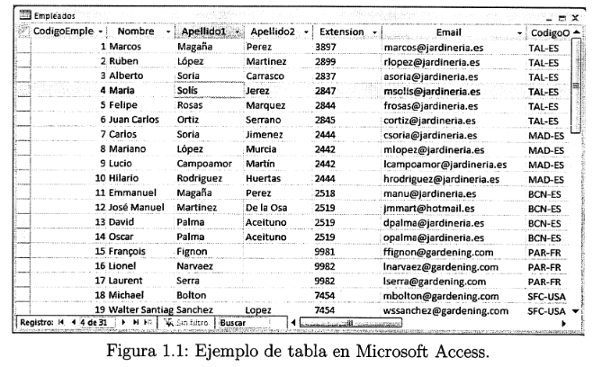
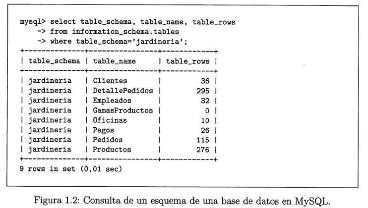

#  1.2 Bases de Datos 

### Una  Base de Datos  es una colección de información perteneciente a un mismo contexto(o problema) , que está almacenada de forma organizada en ficheros.
### Una BBDD está organizada mediante tablas, que almacenan información concerniente a algún objeto o suceso. Estas tablas se relacionan formando vínculos o relaciones entre ellas, que ayudan a mantener la información de los diversos objetos de forma ordenada y coherente(sin contradicciones).

##  1.2.1 Conceptos 

* ###  <b> Dato </b>  : Información concreta sobre algún concepto o suceso . Los datos se caracterizan por pertenecer a un tipo.
* ###  <b> Tipo de Dato </b>  : Indica la naturaleza del campo (numéricos , alfanuméricos , fecha)
* ###  <b> Campo <b>  : Identificador para toda una familia de datos. Cada campo pertenece a un tipo de datos. Al campo también se le llama columna.
* ###  <b> Registro </b>  : Es una recolección de datos referentes a un mismo concepto o suceso. A los registros también se les llama tuplas o filas .

* ###  <b> Campo Clave </b>  : Es un campo especial que identifica de forma única a cada registro. Así, el NIF es único para cada persona, por tanto es campo clave.

* ###  <b> Tabla </b>  : Es un conjunto de registros bajo un mismo nombre que representa el conjunto de todos ellos .

* ###  <b> Consulta </b>  : Es una instrucción para poder hacer peticiones a una base de datos.

* ###  <b> Índice </b>  :  Es una estructura que almacena los campos clave de una tabla, organizándolos para hacer más fácil encontrar y ordenar los registros de esa tabla.

* ###  <b> Vista </b>  : Es una transformación  que se hace a una o más tablas para obtener una nueva tabla. Esta nueva tabla es una tabla virtual.

* ###  <b> Informe </b>  : Es un listado ordenado de los campos y registros seleccionados en un formato fácil de leer.

* ###  <b> Guiones o scripts </b>  : Son un conjunto de instrucciones, que ejecutadas de forma ordenada, realizan operaciones avanzadas de mantenimiento de los datos almacenados en la base de datos.

* ###  <b> Procedimientos </b>  : Son un tipo especial de script que está almacenado en la base de datos y que forma parte de su esquema .

##  1.2.2 Estructura de una BBDD 

### Una base de datos almacena los datos a través de un esquema. Dicho esquema contiene (campos,registros,procedimientos,vistas,etc...) . Al esquema también se le suele llamar  metainformación 
### BBDD como MySQL y DB2 almacenan el esquema de la bbdd en tablas .

##   1.2.4 Evolución y tipos de base de datos 

