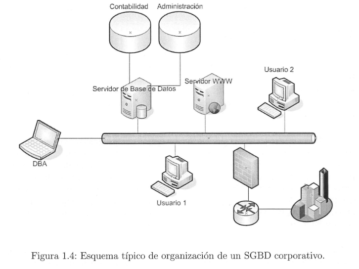

#  1.3 Los Sistemas Gestores de Base de Datos 
##  1.3.1 Concepto de Sistema Gestor de Base de Datos 

### Se define un Sistema Gestor de Base de Datos (SGBD), como el conjunto de herramientas que facilitan la consulta, uso y actualización de una base de datos.

##  1.3.3 El lenguaje SQL 
### Lenguaje sencillo en el cuál el usuario realiza preguntas al servidor, contestando este a las demandas del usuario, este lenguaje se denomina SQL . (se divide en 4 sublenguajes).

* ###  **Lenguaje DML**  : Este lenguaje permite 4 sentencias sencillas("SELECT","INSERT","UPDATE","DELETE").

* ###  **Lenguaje DDL**  : Este lenguaje permite crear toda la estructura de una base de datos ("DROP","CREATE").

* ###  **Lenguaje DCL**  : Incluye ("GRANT" y "REVOKE") que permiten al administrador gestionar el acceso a los datos contenidos en la base de datos.

* ###  **Lenguaje TCL**  : Permitit ejecutar varios comandos de forma simultánea como si fuera un comnando atómico o indivisible ("COMMIT" , "ROLLBACK").

##  1.3.4 Tipos de SGBD 

###  **Los Gestores de Bases de Datos ofimáticas**  (Microsoft Access).

###  **Los Gestores de bases de datos Corporativas**  (Servidores Unix, Windows 200X Server) 

