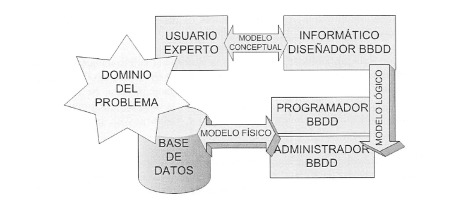

#  **2.2 El modelo de datos** 

### La modelización consiste en representar el problema realizando múltiples abstracciones para asimilar toda la información de un problema, y de esta manera, generar un mapa donde estén identificados todos los objetos de la base de datos.

###  **Modelo conceptual**  : Dirijido a usuarios inexpertos en conceptos informáticos (Entidad/Relación)
###  **Modelo lógico**  : Dirijido a usuarios más expertos al ser más tecnico que el anterior modelo (Modelo relacional)
###  **Modelo Físico**  (Transforma el Modelo Relacional en modelo físico a través del sublenguaje DDL de SQL).

### La interacción entre los tres modelos es fundamental para un diseño de calidad :

* ### 1.Primero, se negocia con el usuario el modelo conceptual.

* ### 2.Segundo, se pasa el modelo conceptual al modelo lógico

* ### 3. Finalmente, se transforma el modelo lógivo en físico, obteniendo de esta forma la BBDD final.

