#  2.3 Diagramas E/R 
### Para representar el modelo conceptual se usará el modelo Entidad/Relación. Este modelo consiste en plasmar el resultado del análisis del prblema mediante diagramas E/R .

##   2.3.1 Entidad 
### Un nombre de entidad solo puede aparecer una vez en el driagrama .

## Hay dos tipos de entidades (fuertes y débiles) .

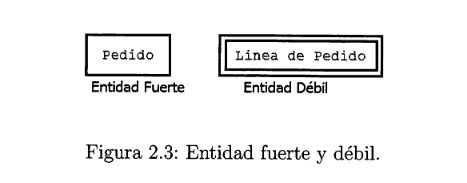

### "Línea de pedido" es la entidad débil ya que depende completamente de la entidad "pedido" .

##   2.3.2 Ocurrencia de una entidad

### Es una unidad de conjunto que representa la entidad 

#### Ejemplo Coche (seat ibiza con matrícula 1222FHD de color negro y con 5 puertas) .

##  2.3.3 Relación 

### Una relación, es una correspondencia o asociación entre dos o más entidades.
### Las relaciones están clasificadas según su grado. EL grado es el número de entidades que participan en la relación.
* ###   Relaciones binarias  : (grado 2), son aquellas que se dan entre dos entidades.

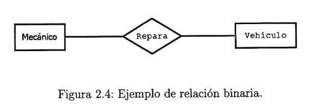

* ###  Relaciones ternarias: (grado 3), son aquellas que se dan entre tres entidades.

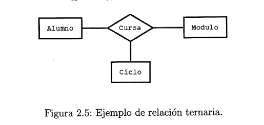

* ###  Relaciones unarias o reflexivas: (grado 1), Es una relación donde la misma entidad participa más de una vez en la relación con distintos papeles .

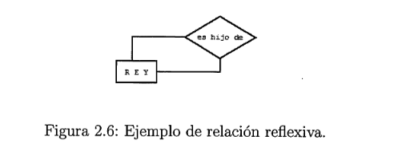

* ###  Relaciones n-arias  (grado > 3), Son aquellas donde participan más de 3 entidades.

##  2.3.4 Participación 

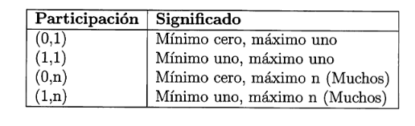

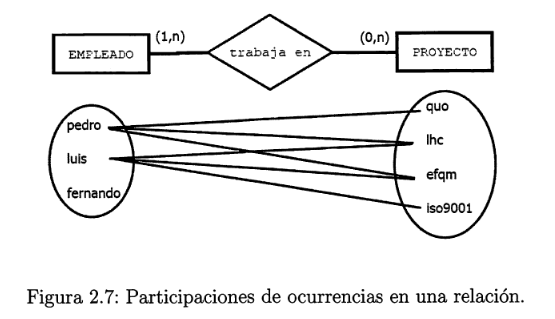

#### La participación de proyecto es de (0,n), puesto que un empleado puede tener asignados de 0 a n proyectos. La participación de empleado es de (1,n) puesto que un proyecto puede haber de 1 a n empleados.De esta manera, se indica al lado de la entidad proyecto, el par(0,n) y al lado de la entidad empleado el par(1,n).

##  2.3.5 Cardinalidad

### Se toman el número máximo de las participaciones de cada una de las entidades en la relación

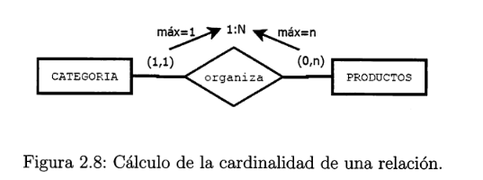

### De esta manera, se clasifican las siguientes cardinalidades:

* ###  **Cardinalidad 1:1** . Esta cardinalidad especifica que una entidad A puede estar vinculada mediante una relación a una y solo una ocurrencia de otra entidad B y al revés.

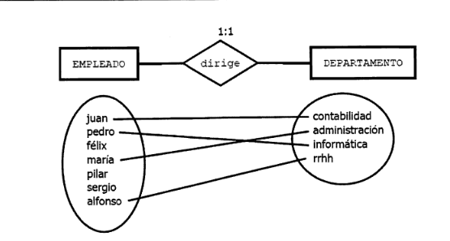

* ###  **Cardinalidad 1:N**  . Esta relación especifica que una entidad A puede estar vinculada mediante una relación a varias ocurrencias de otra entidad B. Sin embargo, una de las ocurrencias de la entidad B solo puede estar vinculada a una ocurrencia de la entidad A.

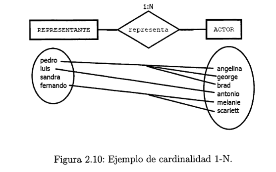

* ###  **Cardinalidad M:N** . Esta cardinalidad especifica que una entidad A puede estar vinculada mediante una relación a varias ocurrencias de la entidad B y al revés .

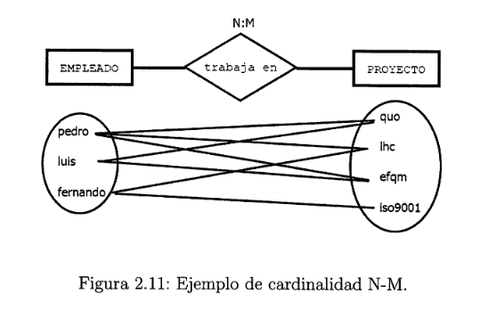

### Existen otras formas de representar la cardinalidad entre entidades :

* ### Puntas de fecha : En esta ocasión, la línea de la relación que termina en flecha, indica la rama N de la cardinalidad de la relación.

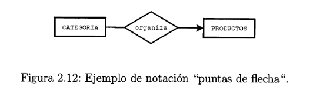

* ###  MySQL Workbench : En esta ocasión, las relaciones se expresan con un pequeño rombo, rellenando en negro la mitad de la figura, en el lado de la entidad cuya cardinalidad es N

##  2.3.6 Cardinalidad de relaciones no binarias

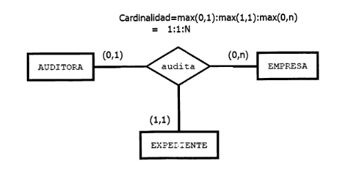

##  2.3.7 Cardinalidad de las relaciones reflexivas. 

### En las relaciones reflexivas, la misma entidad juega dos papeles distintos en la relación. Para calcular su cardinalidad hay que extraer las particiones según los dos roles existentes.

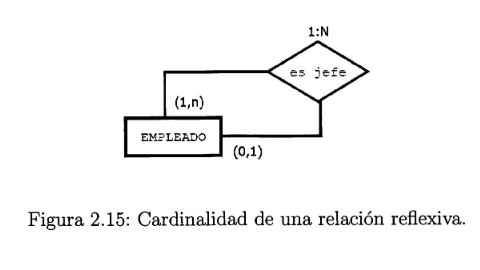

##    2.3.8 Atributos y Dominio  

### Los atributos de una entidad son las características o propiedades que la definen como entidad. Se representan mediante elipses conectadas directamente a  la entidad .

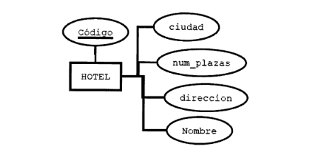

###  **Atributo Clave**  : Aparece en subrayado , indica que no se puede repetir  y que con solo una sola referencia se riene acceso al resto de atributos de forma directa .

###  **Atributo de relación**  : Es propio de la relación y que no puede ser cedido a las entidades que intervienen .

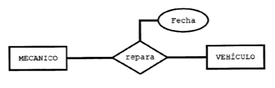

###  **Dominios**  : el tipo de dato de los atributos 

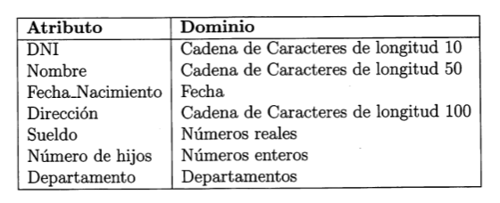

##  2.3.9 Tipos de atributo 

* ###  **Atributos obligatorios**  : Debe de tomar un valor obligatoriamente 

* ###  **Atributos opcionales**  : El atributo tiene un valor nulo .

* ###  **Atributos compuestos**  : Atributo que se puede transoformar en subatributos (hora_salida = hora y minutos)

* ###  **Atributos univaluados**  : Un atributo que toma un único valor .

* ###  **Atributos multivaluados**  : Puede tomar varios valores (teléfono= teléfono móvil y teléfono fijo).

* ###  **Atributo derivado**  :  atributos que se calculan a través de otros atributos (Edad= fecha de nacimientos de la persona)

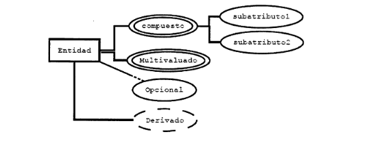

##  2.3.10 Otras notaciones par alos atributos 

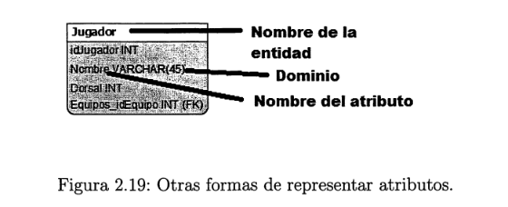

##  2.3.11 La entidades débiles  

### La entidad débil depende de la fuerte , si la fuerte desaparece , también desaparecería la débil .

* ###  **Dependencia de existencia**  : La entidad débil perdería el sentido sin la relación con la entida fuerte en la BBDD

* ###  **Dependencia de indentificación**:  La entidad débil necesita de la fuerte para poder crear una clave, de tal manera que pueda completar la identificación de sus ocurrencias.

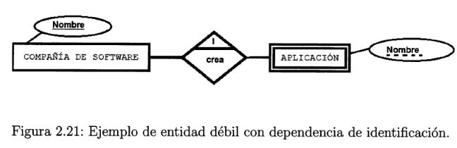

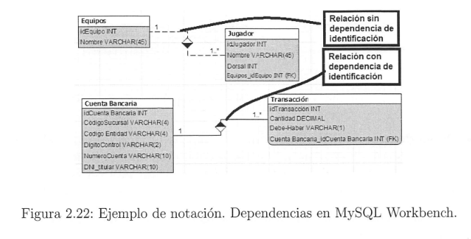

