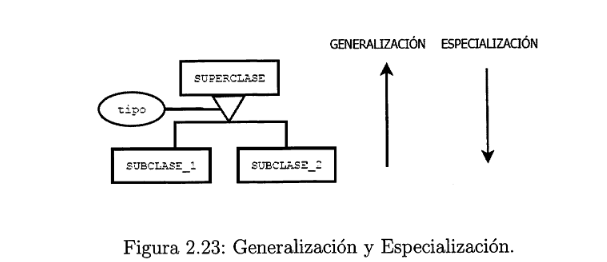
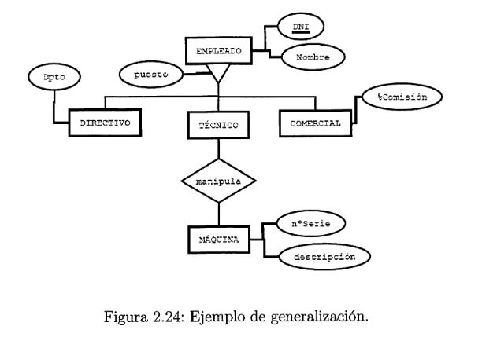
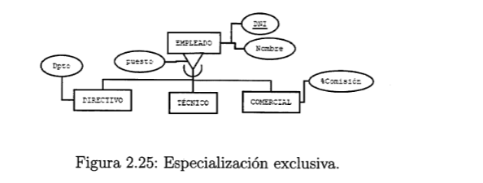
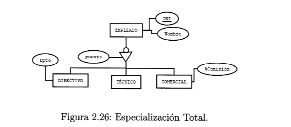

#  2.4. El modelo E/R ampliado 

##  2.4.1 Generalización y Especialización 

### Una entidad E es una generalización de un grupo de entidades Ei, E2, ... En, si cada ocurrencia de cada una de esas entidades es también una ocurrencia de E.

### Todas las propiedades de la entidad genérica E son heredadas por las subentidades. Además, cada subentidad tendrá sus propios atributos independientes de la generalización.
### La relación de generalización se representa mediante un triángulo isósceles pegado por la base a la entidad superclase

### **Tipos de especialización**  

* ### **Especialización Exclusiva**  : Cada una de las ocurrencias de la superclase solo puede materializarse en una de las especializaciones . Ejemplo (si un empleado es un directivo, no puede ser un técnico o un comercial)

* ### **Especialización Inclusiva**  : Como el ejemplo anterior el empleado directivo , podría ser técnico y comercial (se representa sin el arco).

* ### **Especialización Total**  : Se produce cuando la entidad superclise tiene que materializarse obligatoriamente en una de las especializaciones .

* ### **Especialización Parcial**  : La entidad superclase no tiene que materializarse en una de las especializaciones (es opcional) .
