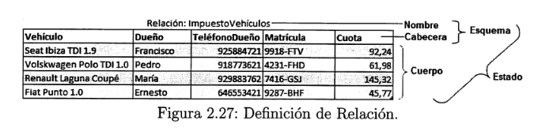

#  2.6 El modelo relacional  

### El objetivo del modelo relacional es proteger al usuario de la obligación de conocer las estructuras de datos físicas con las que se representa la información de una BBDD. Desvincular estas estructuras de datos, que son complejas por naturaleza, del diseño lógico(Modelo Relacional), permite que la base de datos se pueda implementar en cualquier gestor de bases de datos relacional(Oracle,MySQL,DB2,etc.) .

##  2.6.1 Las relaciones en el modelo relacional 

##  2.6.2 Otros conceptos del modelo relacional

### A continuación se definen los conceptos necesarios para transformar el modelo conceptual(E/R) en el modelo lógico (modelo relacional)

* ###  **Atributo**  :  Características que describen a una entidad o relación.

* ###  **Dominio**  : Conjunto de valores permitidos para un atributo.

* ###  **Restricciones de semántica**  : Condiciones que deben cumplir los datos para su correcto almacenamiento. Hay varios tipos:
     * ###  Restricciones de clave  : Conjunto de atributos que identifican de forma única a una entidad.
     * ###  Restricciones de valor único (UNIQUE)  : Restricción que impide que un  atributo tenga un valor repetido. 
     * ###  Restricciones de integridad referencial  : Se da cuando una tabla tiene una referencia a algun valor de otra tabla. En este caso la restricción exige que exista el valor referenciado en la otra tabla.
     * ###  Restricciones de dominio  : El valor que puede tomar unn campo esté dentro del dominio definido.
     * ###  Restricciones de verificación (CHECK) : Esta restricción permite comprobar si un valor de un atributo es válido conforme a una expresión
     * ###  Restricciones de valor NULO (NULL o NOT NULL)  : Un atributo puede ser obligatorio si no admite el valor NULO o NULL , es decir, el valor falta de información o desconocimiento. SI admite como valor el valor NULL, el atributo es opcional.
     * ###  Disparadores o triggers  : Son procedimientos, que se ejecutan para hacer una tarea concreta en el momento de insertar, modificar o eliminar informaciñón de una tabla.
     * ###  Restricciones genéricas adicionales o aserciones (ASSERT)  : Permite validar cualquiera de los atributos de una o varias tablas .
* ###  **Clave** : Una clave es un conjunto de atributos que identifican de forma única una ocurrencia de entidad.
    * ###  Superclave 
    * ###  Clave Candidata 
    * ###  Clave primaria  : Es la clave candidata elegida por el diseñador como clave definitiva 
    * ###  Clave foránea  : Es un atributo de una entidad, que es clave en otra entidad. Ejemplo (La nota en un módulo de una asinatura corresponde a un DNI, que es clave de otra entidad. En este caso el DNI es una clave foránea en la tabla notas).

