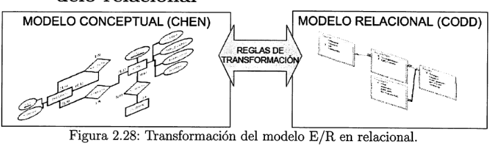
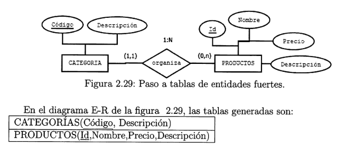
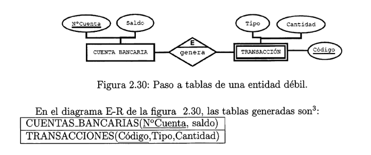
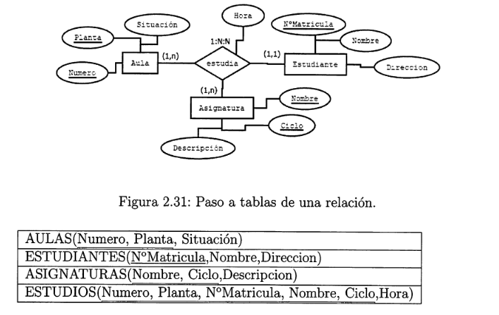
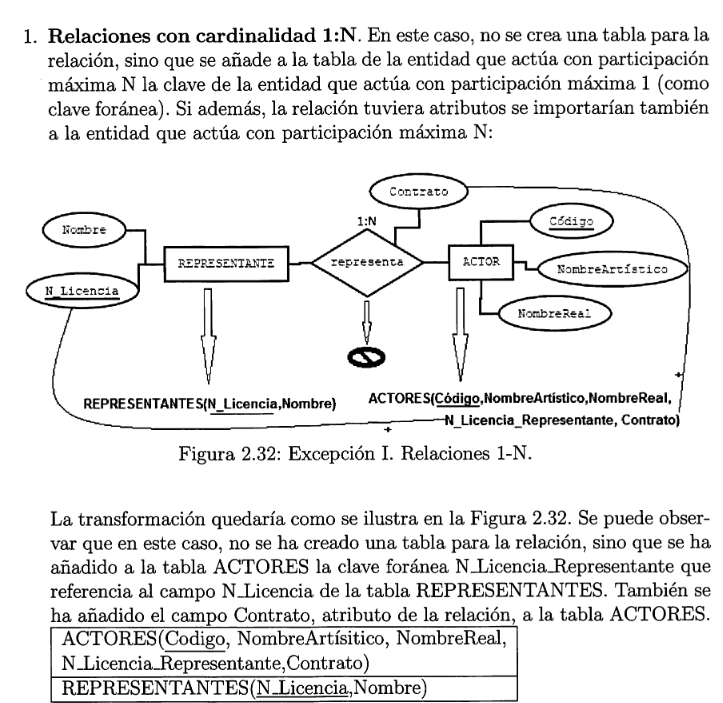
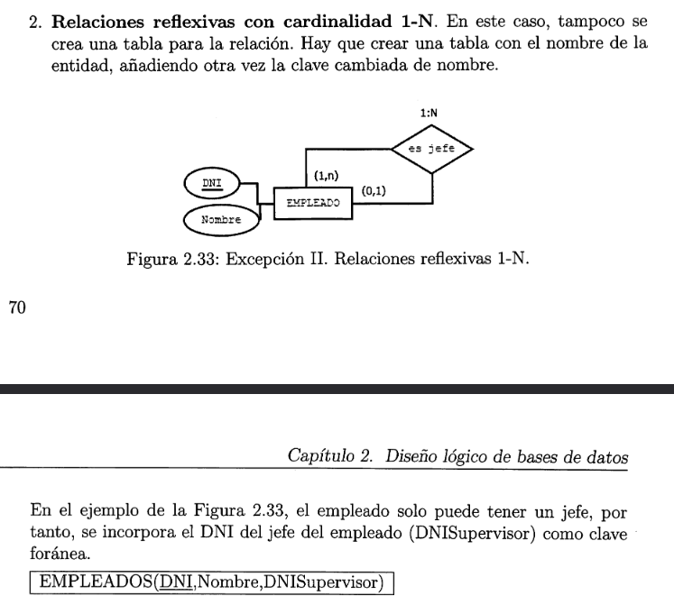
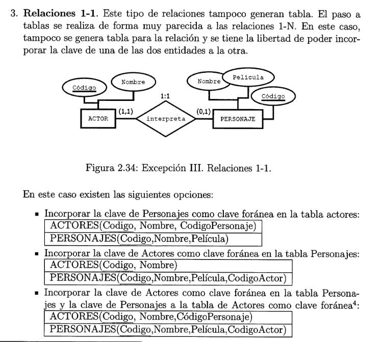
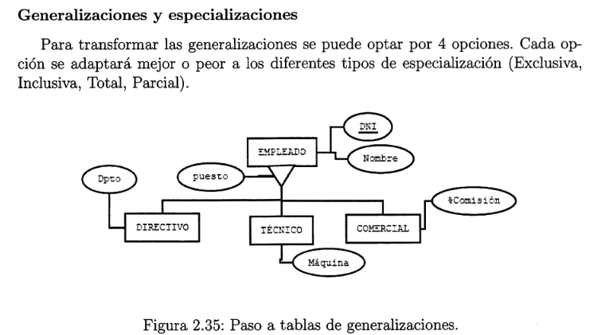
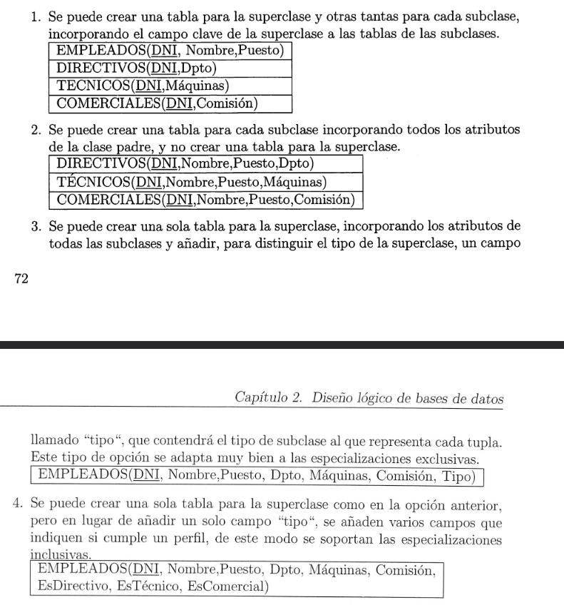

#  2.7.Transformación de un diagrama E/R al modelo relacional

### **Transformación de entidades fuertes** 

### **Transformación de entidades débiles** 

###  **Transformacion de relaciones** 

### Hay alguna excepciones a la regla general :

### **1.Relaciones con cardinalidad 1:N** 

### **2.Relaciones reflexivas con cardinalidad 1-N** 

### **3.Relaciones 1-1** 

###  **Generalizaciones y especializaciones** 

