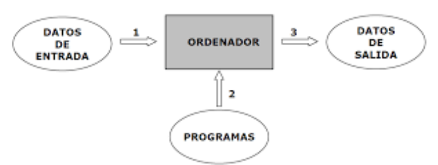
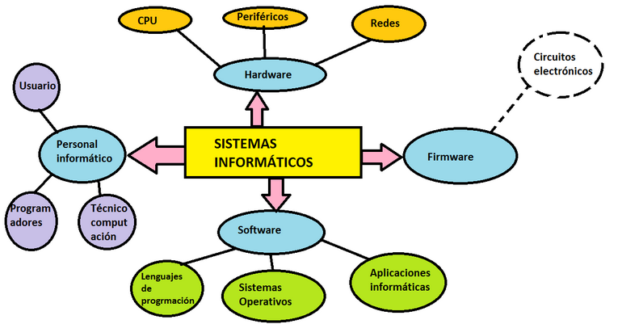
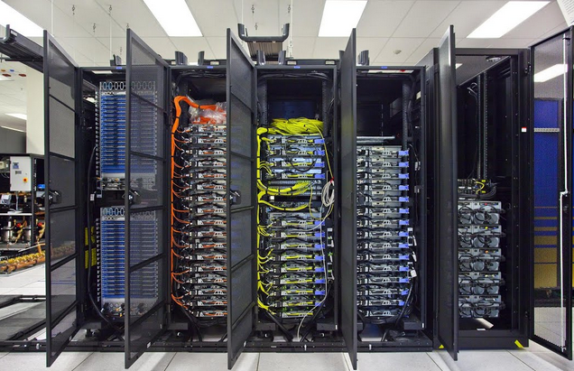
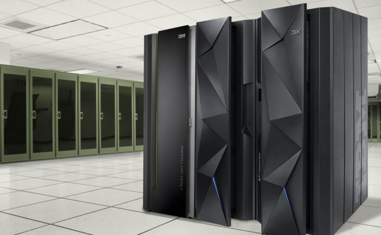
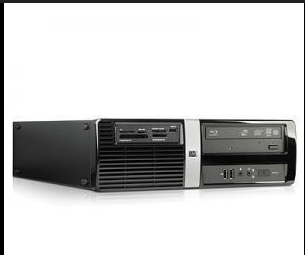
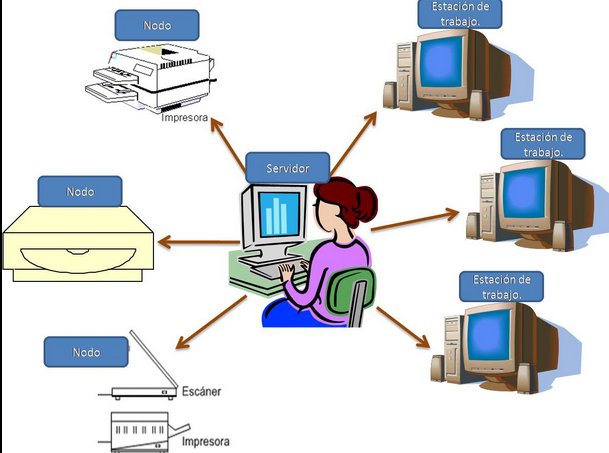
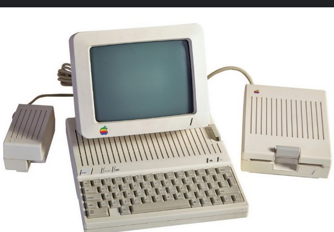

# 1.1 El Sistema Informático
## Ordenador
### Máquina electrónica dotada una memoria de gran capacidad y de métodos de tratamiento de la información, capaz de resolver problemas aritméticos y lógicos gracias a la utilización automática de programas registrados en ella.
### Un ordenador transforma los datos de entrada en una salida conteniendo la información requerida. Los datos son conjuntos de símbolos utilizados para representar un valor numérico, un objeto o una idea en la forma adecuada para ser un objeto de tratamiento.

## Sistema Informático

### Interelación entre el ordenador (procesa u almacena los datos) , el usuario que maneja el ordenador y los periféricos que lo envuelven.

### Todo sistema informático está compuesto por tres elementos básicos:

### Hardware (placas,circuitos integrados,cables y sistema de comunicaciones).
### Software (dispone de un lenguage lógico para comunicarse con el hardware)
- ### Software base (programas necesarios para que el hardware tenga capacidad de trabajar, también recibe el nombre de SO )
- ### Software de aplicación (programas que maneja el usuario)

## 1.1.1 Clasificación de los sistemas informáticos 
### Los sistemas informáticos se pueden clasificar de dos maneras:
### Por su uso:
- ### Sistemas informáticos de uso general, se utilizan para varios tipos de aplicaciones (ordenadores personales).
- ### Sistemas informáticos de uso específico, se caracterizan para ejecutar uno o unos pocos programas (robots industriales, videojuegos)
### Por sus prestaciones:
- ### Superconputadores , equipos con gran capacidad de cálculo. Se utilizan en el entrono técnico-científico.
     
- ### Sistemas grandes, computadoras centrales o  mainframes. Son equipos utilizados para dar soporte a grandes redes de comunicaciones con cientos o incluso miles de usuarios. (Transacciones bancarias)
    
- ### Sistemas medios o  miniordenadores. Son equipos con capacidad para soportar cientos de usuarios con un coste y unas prestaciones inferiores a los grandes sistemas. Son también conocidos como servidores de redes conn terminales tontos . Actualmentes están en desuso siendo remplazados por microordenadores interconectados entre sí (estaciones de trabajo) y con un servidor .
    
- ###  Estaciones de trabajo. SOn equipos monousuarios muy potenetes y especializados, algunoos con tecnología RISC, que permiten conseguir un aumentos de prestaciones (diseño, CAD) . Los microordenadores actuales son más potentes que las mejores estaciones de trabajo de anteriores generaciones
    
- ###  Microordenadores. Son equipos monousuarios menos potentes que se pueden clasificar de varias maneras. Entre ellas se encuentran: ordenadores profesionales y personales, ordenadores de oficina y domésticos, y ordenadores de escritorio y portátiles.
    

## DIFERENCIA ENTRE SUPERCOMPUTADOR Y MAINFRAME

### La diferencia es que los superconductores se centran en los problemas limitados por la velocidad de cálculo, mientras que los mainframes se centran en los problemasm limitados por los dispositivos de entrada y salida (e/s) y la fiabilidad de los transacciones.