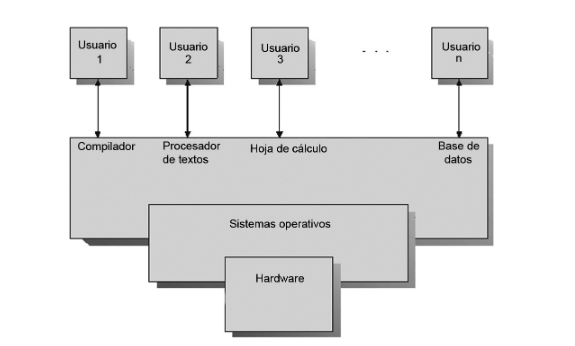
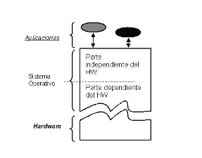
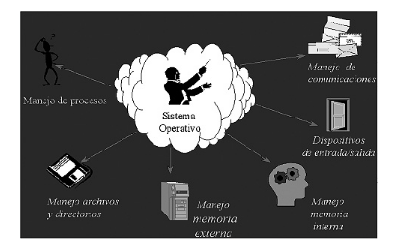
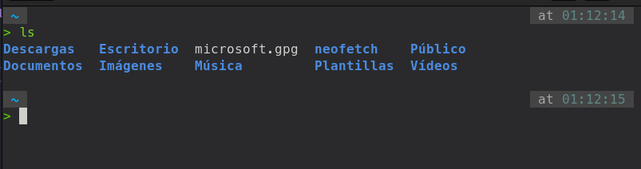

# 1.2 El Sistema Operativo

### Programa o conjunto de programas que actúa como intermediario entre el usuario y el hardware del ordenador , gestionando los recursos los recursos del sistema y optimizando su uso.

### El <b>sistema operativo</b> es en sí mismo un programa, pero un programa muy especial y quiza el más complejo e importante. Cuando se conecta un ordenador se carga parte del sistema operativo en la memoria y se ejecuta. El sistema operativo despierta al ordenador y hace que reconozca a la CPU, la memoria , las unidades de disco y cualquier otro dispositivo conectado a ella como el teclado, el ratón, la impresora,etc..., verificando así que no existan errores de conexión y que todos los dispositivos se han reconocido y tabajan correctamente. A este primer diagnóstico se le denomina <b>POST/BOOT</b>

## 1.2.1 Funciones del Sistema Operativo 

- ### Control de la ejecución de programas.
- ### Administración de periféricos.
- ### Gestión de permisos y de usuarios
- ### Control de concurrencia (Establece prioridades cuando diferentes procesos solicitan el mismo recurso)
- ### Control de errores (Gestiona los errores del hardware y la pérdida de datos)
- ### Administración de memoria (Asigna memoria a los procesosy gestiona su uso.)
- ### Control de seguridad ( debe proporcionar seguridad tanto a los usuarios como para el software y la información almacenada en los sistemas)

## 1.2.2 Elementos y estructura de un sistema operactivo 

### La estructura de un SO se puede analizar en 5 niveles.
### Nivel 1. Gestión del procesador.  
### En este nivel se encuentra el **Kernel** o núcleo que es la parte del SO encargada de la gestión de la CPU. Cuando arranca el ordenador, se carga en memoria y permanece allí, realizando funciones básicas 
### Nivel 2. Gestión de memoria. 
### En este nivel se encarga de repartir la memoria disponible entre los procesos. Se realizan funciones de asignación y liberación de memoria, y el control de violación de acceso a zonas de memoria no permitidas
### Nivel 3. Gestión de procesos.  
### En este nivel es el encargado de la creación y destrucción de procesos
### Nivel 4. Gestión de dispositivos. 
### En este nivel se realiza la gestión de las (e/s) en función de los dispositivos existentes 
### Nivel 5. Gestión de la información.  

### El objetivo de este nivel es el de gestionar el espacio de nombres lógicos, utilizados para simplificar el acceso a los recursos, ya que mediante éstos se sustituyen rutas de acceso que pueden ser muy largas y difíciles de recordar por un solo nombre, encargándose el so , de forma totalmente transparente para el usuario, de realizar esa búsqueda de ruta.

### **Cada nivel utiliza las funciones que le brinda el nivel inferior que es el más cercano a la máquina, en general**

##  1.2.3 Utilización del Sistema Operativo. 

### Se puede comunicar con el SO mediantes dos formas : 

### Modo comando :

### Interfaz gráfica

