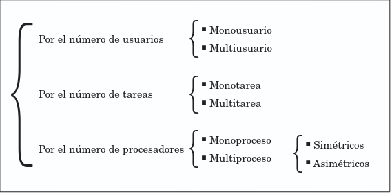

#  1.3 Clasificaciones de los SO 
## 1.3.1 Por los servicios ofrecidos
 
### **Vision desde root**

### Dentro de los sistemas multiproceso, se encuentran los sistemas simétricos, que son los que distribuyen la carga del procesamiento por igual entre todos los procesadores existentes , los asimétricos, asignan una tarea por procesador existente, según su prioridad, y el resto de tareas(baja prioridad) se ejecutan en un único procesador

##  1.3.2 Por la forma de ofrecer los servicios

### Sistemas Centralizados. 

### Antes la mayoría de los sistemas utilizaban el modelo de proceso centralizado. Con este tipo de modelo los computadores mainframe se encargaban de todo el procesamiento y los usuarios manejaban únicamente terminales tonto (es decir,no disponían de memoria, noi procesador).
### Actualmente se siguen utilizando los sistemas centralizados , pero los terminales dejan de ser tontos y pueden realizar otras muchas tareas por sí mismos.

### Sistemas Distribuidos.
### Los SO distribuidos permiten distribuir los trabajos,tareas o procesos entre un conjunto de procesadores. (Sprite,MC,Solaris,Mach).

### Sistemas Operativos en red. 
### Son aquellos que mantienen a dos o más computadoras unidas a través de algún  medio de comunicación (físico o no), con el objetivo primordial de poder compartir los diferentes recursos y información del sistema (Linux Server, Windows Server, etc...).

### Sistemas Operativos de escritorio. 

### Estos se utilizan en los equipos de sobremesa , estaciones de trabajo o portátiles , también se les puede denominar sistemas operativos cliente. (Windows 7 , Linux).

##  1.3.3 Por su disponibilidad 

###  Sistemas Operativos propietarios 

### Necesitas de una licencia para poder modificar u distribuir el software (Windows).

###  Sistema operativo libre  

1. ### Tienes libertad de usar el programa con cualquier propósito.
2. ### Tienes la libertad de estudiar como funciona el programa y modificarlo adaptándolo a las necesidades que tuviera el usuario
3. ### TIenes la libertad de distribuir copias del programa, con lo que se puede ayudar a otros usuarios
4. ### Tienes la libertad de mejorar el programa y hacer pública dichas mejoras a otros usuarios.

### El software libre suele estar disponible gratuitamente o al precio de coste de la distribución a través de otros medios; sin embargono es obligatorio que sea así,por lo tanto, no hay que asociar  software libre a software gratuito  , ya que conservando su carácter libre, podrá ser distribuido comercialmente  (software comercial) .
### Tampoco debe confundirse software libre con  software de dominio público.Este último es aquel que no requiere de licencia pues sus derechos de explotación pertenecen a todos  por igual y cualquiera puede hacer uso de el, siempre con fines legales y consignado su autoría original.

