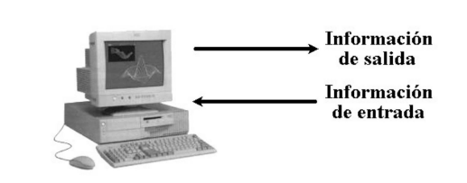
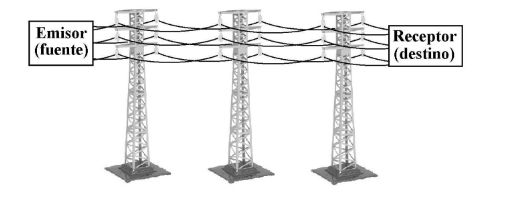
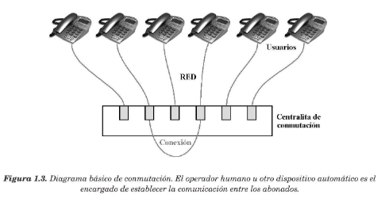

#### <span style="color:gold">**Sistema Informático** </span> : es aquél que realiza algún tipo de tratamiento de la información.



#### El sistema informático necesita conocer cómo debe procesar la información. Esta característica la obtiene a través de un <span style="color:gold"> **programa** </span> que tiene almacenado y que contiene todas las instrucciones para la elaboración de los datos. 
##### Ejemplo : En una calculadora, el programa indica que operación numérica debe realizarse(suma,resta,etc,...) y puede seleccionarse por el usuario .
#### <span style="color:gold">**Telecomunicación** </span> : toda transmisión, emisión o recepción de signos, señales, imágenes, sonidos o informaciones de cualquier tipo que se transmiten por hilos, medios ópticos, radioeléctricos u otros sistemas electromagnéticos.
#### <span style="color:gold"> **Red de transmisión de datos** </span> : Se trata de un soporte que permite la conexión de diversos equipos informáticos(o de cualquier otro dispositivo electrónico) con el objetivo de suministrarles la posibilidad de que intercambien informaciones.



```bash
Señal recibida = Señal enviada + Ruido
# Hay que introducir mecanismos de detección y corrección de errores. 
```

#### Una red de transmisión de datos no está formada única y exclusivamente por el medio de transmisión . Cuando existe una gran cantidad de usuarios, es necesario un mecanismo que establezca comunicaciones entre ellos, incluso a través de un mismo cable .

#### Por lo tanto, los elementos de una red de comunicación son los siguientes:

* #### <span style="color:gold"> **Sistema de transmisión** </span> : es la estructura básica que soporta el transporte de señales por red.

* #### <span style="color:gold"> **Sistema de conmutación** </span> : mecanismo que permite el encaminamiento de la información hacia su destino. El ejemplo más simple de este sistema lo constituye un opperador de telefonía (centralita) que se encarga de conectar a dos usuarios que desean comunicarse

* #### <span style="color:gold"> **Sistema de señalización** </span> : para que la comunicación sea posible, es necesario que exista un sistema de inteligencia distribuido por la red que sincronice todos los recursos que se encuentran en ella . Este control se lleva a cabo enviando señales a los distintos elementos que intervienen en la comunicación .



#### Una **red de computadoras** es un conjunto de ordenadores que poseen dos características diferenciadoras:
1. #### Se encuentran interconectadas mediante algun medio de transmisión (es decir, pueden intercambiar información).
2. #### Son autónomas, es decir, tienen cierta potencia de cálculo(pueden realizar procesado de datos) y no son controladas por otras computadoras centrales .


