# <span style="color:gold">**1.1 SISTEMAS DE NUMERACIÓN**</span>

#### Los sistemas de numeración pueden ser <span style="color:gold">**aditivos** </span>, en los que se suman los símbolos que representan cada cantidad y donde no es relevante el orden en el que aparezcan (sistema egipcio) . También pueden ser <span style="color:gold">**híbridos** </span>, donde se multiplican los símbolos antes de sumarlos (sistema chino) . Muchos sistemas están basados en los múltiplos de 10(los sistemas de numeración de base 10), aunque otros sistemas utilizan varias bases(el sistema babilónico usa las bases 10 y 60)

#### <span style="color:gold"> **Sistema de numeración egipcio** </span>
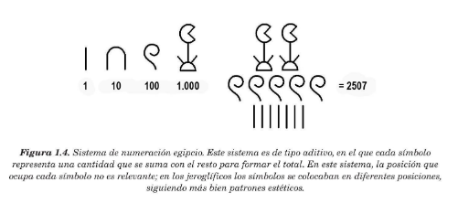

#### <span style="color:gold"> **Sistema de numeración chino** </span>
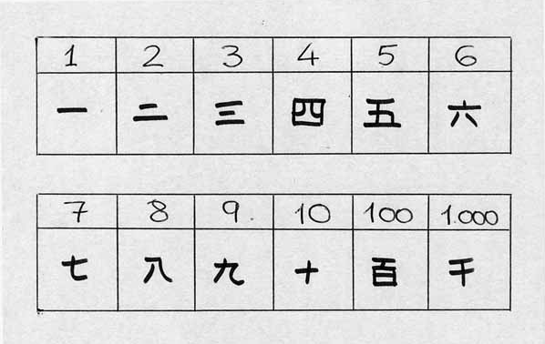

#### <span style="color:gold"> **Sistema de numeración babilónico** </span>

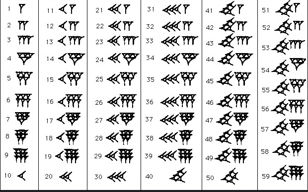

#### Los sistemas de numeración más utilizados actualmente son los <span style="color:gold">**posicionales** </span>(cada símbolo normalmente tendrá mas valor cuánto más a la izquierda se sitúe)

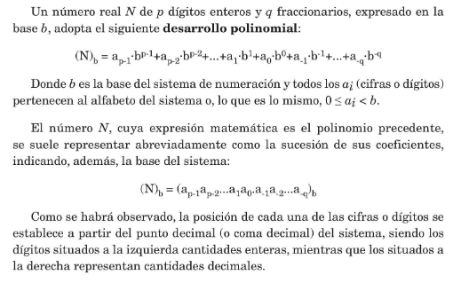


```bash
#### Ejemplo en la base 4 
(230103)₄ = 2×4⁵+3×4⁴+0×4³+1×4²+0×4¹+3×4⁰ = (2835)₁₀
```

## <span style="color:gold"> 1.1.1 SISTEMA DECIMAL </span>

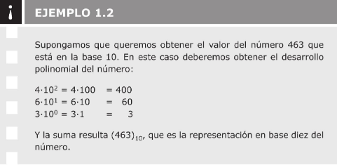

## <span style="color:gold"> 1.1.2 SISTEMA BINARIO </span>

#### En el sistema binario el alfabeto está formado por los símbolos (0,1) y la base es b=2.Un método directo para obtener el valor de la cantidad expresada por un número de base 2 a base 10 consiste en utilizar el desarrollo polinomial.

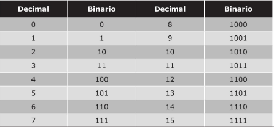

```bash
# El número 101100101 en base 2 representa:
(101100101)₂ = 1×2⁸+0×2⁷+1×2⁶+1×2⁵+0×2⁴+0×2³+1×2²+0×2¹+1×2⁰ = (357)₁₀
```

#### Para contar, empecamos por el 0, seguido del 1; ya no tenemos más dígitos y, por lo tanto, empezamos a formar números de dos cifras: 10 y 11; ahora tenemos que pasar a tres cifras: 100,101,110,111. Esto es debido a que al ser binario(base 2) , solo tenemos los dígitos (0 y 1).

#### Con n dígitos binarios se pueden representar todos los números enteros positivos comprendidos en el rango  [0,2^n-1]

## <span style="color:gold"> **1.1.3 CONVERSIONES ENTRE DECIMAL Y BINARIO** </span>

#### Para pasar un número representado en el sistema binario al decimal, basta con realizar su desarrollo polinomial : 

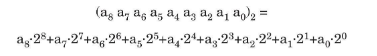

#### Para pasar un número de decimal a binario, se trata la parte entera y la parte decimal por separado. Tomando la parte entera del número decimal, se realizan divisiones enteras sucesivas por 2 hasta que el cociente obtenido sea 0, y se toman los restos de las divisiones en orden inverso (empezando por el último resto, que es siempre 1 y los demás solamente pueden ser 0 ó 1).

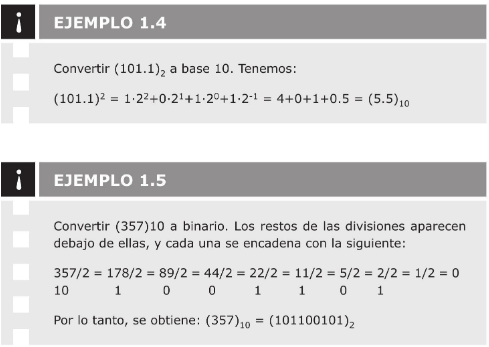


#### Por otro lado, para convertir la parte fraccionaria de un número decimal a binario, se realizan multiplicaciones sucesivas y se va eliminando la parte entera obtenida, que es la que se toma para formar el número en binario (siempre será 0 ó 1). El proceso finaliza cuando se obtenga como resultado 0 o se consigan suficientes dígitos binarios(hasta una aproximación adecuada). Hay que tener en cuenta que un número en base 10 formado por un número finito de dígitos decimales puede convertirse en un número con infinitos dígitos decimales en binario.

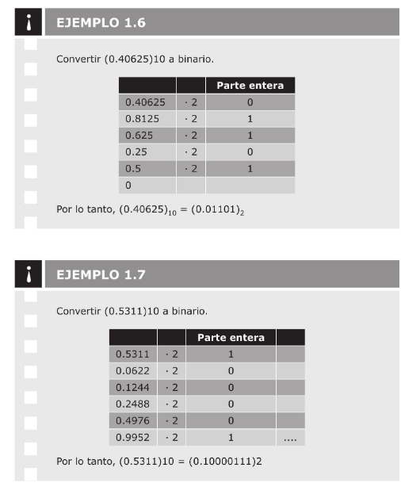


## <span style="color:gold"> **1.1.4 SISTEMA HEXADECIMAL** </span>

#### En este sistema, la base es b=16, es decir 16 símbolos diferentes para representar los números. El sistema hexadecimal representa los números utilizando los símbolos (0,1,2,3,4,5,6,7,8,9,A,B,C,D,E,F) 

#### La clave del sistema de numeración hexadecimal reside en que su base es potencia de dos: 2⁴=16. De este modo, la conversión entre los dos sistemas es inmediata y cada cifra en hexadecimal representa las mismas cuatro cifras de binario, independientemente de la posición que ocupen .


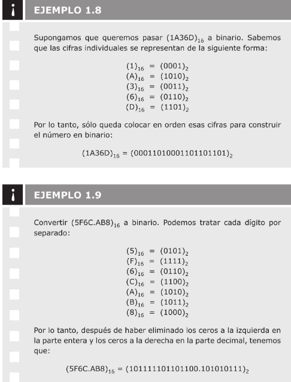

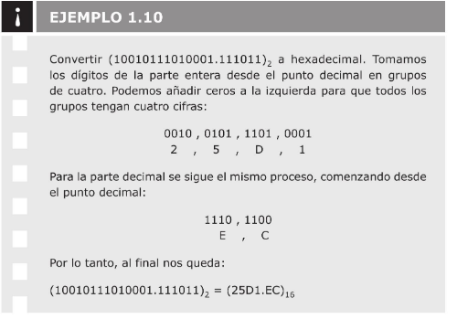


