#  **1.2 INTRODUCCIÓN A LA COMUNICACIÓN DE DATOS** 

#### Para que dos ordenadores puedan intercambiar información. es necesario que existan unos dispositivos que la transporten desde el equipo origen al destino.

##  **1.2.1 CONCEPTOS BÁSICOS** 

#### Un ordenador esta formado por el hardware(teclado,pantalla,placa base,etc...) y el software/programas (Windows,LibreOffice) .

#### Los programas indican al ordenador, como debe trabajar los datos, estos programas están almacenados en la memoria del ordenador como [0 y 1 (tensiones eléctricas)].

#### Si deseamos permitir la comunicación entre varios ordenadores, necesitamos conectarlos a una red de transmisión de datos , esta red está formada por tres partes fundamentales : 

* ####  **Terminales**  : son los equipos que se comunican (ordenadores , teléfonos) , éstos determinan la naturaleza de la información que va a tener que manejar la red(voz,datos,etc...).

* ####  **Dispositivos de red**  : elementos físcos que permiten la comunicación entre el terminal emisor y receptor.
    - ####  **Canal de comunicación**  : es el medio por el que circula la información
    - ####  **Elementos de interconexión**  : se encargan de interconectar todos los terminales de la red y tambien trabajan para seleccionar el mejor camino por el que circulará la información (es en el caso de que exita más de un camino).
    - ####  **Adaptadores de red** : son los encarfgados de convertir el formato de información de los terminales (normalmente en forma de señales eléctricas) en el formato utilizado por la red de comunicación(señales eléctricas,ondas de radio,etc.).

* ####  **Programas de red**  : son todos los programas que permiten controlar el funcionamiento de la red, para hacerla más fiable.

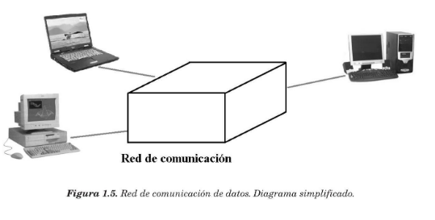

##  **1.2.2 SERCICIOS Y PROTOCOLOS** 

#### Los **servicios**  de comunicaciones proporcionados por una red de transmisión de datos siguen unos **protocolos** bien establecidos y estandarizados. Si una red en particular se le desea añadir una funcionalidad concreta, se debrá comprobar si ya posee el *protocolo* adecuado o hay que añadírselo.

#### Un *protocolo* de red define unas normas a seguir a la hora de transmitir la información, normas que pueden ser: velocidad de transmisión, tipo de información, formato de los mensajes ,etc ...

*Ejemplo en un sistema telefónico, los servicios proporcionados pueden ser (transmisión de voz u datos, llamada de espera,etc...) y los protocolos/reglas , para establecer una comunicación debe seguir estrictamente los siguientes pasos:*

#### Los **servicios** básicos que puede proporcionar una red de comunicación son los siguientes:

* ####  **Transmisión de voz** : éste es el servicio básico que han ofrecido las redes de transmisión desde sus inicios.

* #### **Transmisión de datos** : la información que se transmite pueden ser, **bloques de reducido tamaño**(mensajes de correo electrónico), **datos esporádicos**(comandos para ejecutarse de forma remota en otro equipo,conexión con un servidor Web,etc.), **bloques de datos de gran tamaño**(archivos transferidos), **video digital** (con una gran cantidad de imágenes por segundo),etc. La tendencia actual conduce hacia la integración total de todos estos servicios en una sola red de comunicación. El obstáculo principal es que algunas redes disponen de una capacidad de transmisión limitada.

* ####  **Establecimiento de la llamada**  : es fundamental en la mayoría de redes, no es así, como en el envió y recepción de mensajes SMS.

* ####  **Tarificación** : todas las redes públicas, a excepción de las privadas, disponen de este servicio que permite conocer el grado de utilización de los servicios de comunicación del usuario. (tiempos de conexión, catidad de información transmitida,etc.)

    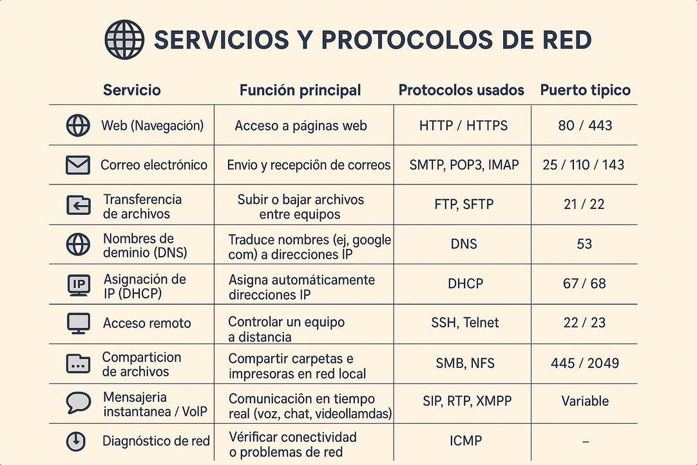

##  **1.2.3 CLASIFICACIÓN DE LAS REDES LOCALES** 

#### Existen multitud de redes, cada una de ellas con unas características específicas que las hacen diferentes del resto. Podemos clasificar a las redes en diferentes tipos, atendiendo a distintos criterios. La clasificación que se expone a continuación está ordenada según los criterios más importantes.

###  **1.2.3.1 Titularidad de la red** 

#### Esta clasificación atiende a la propiedad de la red, por lo que se puede hacer una división de dos tipos de redes: redes privadas dedicadas y redes compartidas.

* ####  **Redes dedicadas**  : sus líneas de comunicación son diseñadas por el usuario o administrador,o bien,alquiladas a las compañías de comunicaciones que ofrecen este tipo de servicios, y siempre para uso exclusivo (red local de un aula de informática de instituto).

* ####  **Redes compartidas**  : son aquellas en las que sus líneas de comunicación soportan información de diferentes usuarios(*redes de servicio público por compañías de telecomunicaciones bajo cuotas de alquiler, en función de su utilización o bajo tarifas por tiempo limitado*). Pertenecen a este grupo las redes telefónicas conmutadas y las redes especiales para la transmisión de datos. (red de telefonía fija,red de telefonía móvil,RSDI, Iberpac, redes de fibra óptica,etc.)

    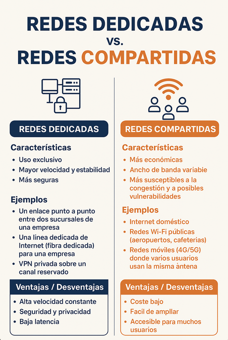

###  **1.2.3.2 Topología** 

#### Esta clasificación tiene en cuenta la arquitectura de la red,es decir, la forma en la que se interconectan los diferentes nodos o usuarios de ella.

* ####  **Malla**  : es una interconexión total de todos los nodos, con la ventaja de que,si una ruta falla, se puede seleccionar otra alternativa. Este tipo de red es más costoso de construir, ya que hace falta más cable.

    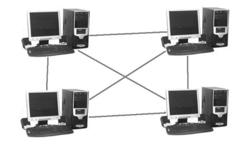

* ####  **Estrella**  : los esquipos se conectarán a un nodo central con funciones de distribución, conmutación y control. Si el nodo central falla , quedará inutilizada toda la red,si es un nodo de los extremos,sólo éste quedará aislado.
    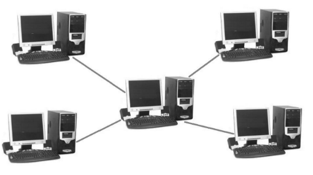

* ####  **Bus**  : utiliza un único cable para conectar los equipos. Esta configuración es la que requiere menos cableado, pero tiene el inconveniente de que,si falla algún enlace, todos los nodos quedan aislados(debido a que este cable se rompe y queda abierto) 

    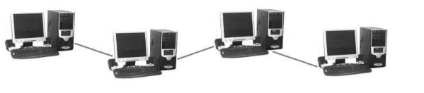

* ####  **Árbol**  : conectar nodos de forma jerarquizada , si falla algún nodo , deja al conjunto de nodos incomunicados entre sí (se utiliza ampliamente en redes de telefonía, donde los enlaces intermedios son centralitas locales y regionales).

    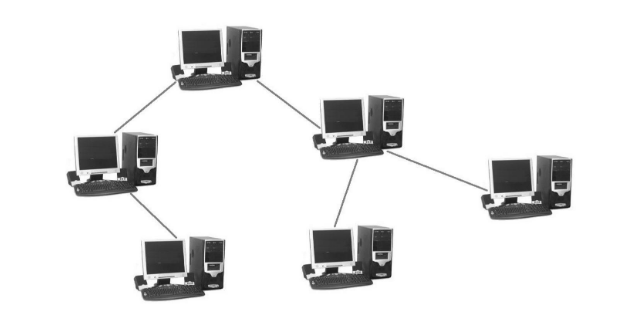

* ####  **Anillo**  : estan conectados a única vía con sus dos extremos unidos. Si falla algún enlace, la red deja de funcionar completamente .

    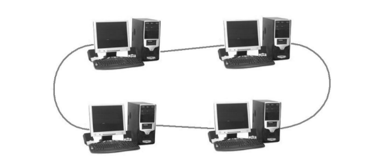

* ####  **Intersección de anillo**  : varios anillos conectados por nodos comunes, si falla algun nodo común de los anillos, toda la red dejará de funcionar.

    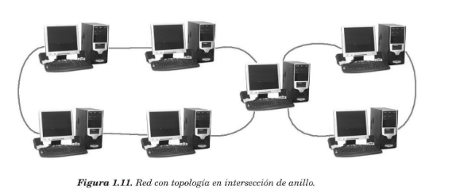

* ####  **Irregular**  : cada nodo debe estar conectado,como mínimo, por un enlace, pero no existen más restricciones. Permite la búsqueda de rutas alternativas cuando falla alguno de los enlaces.

*La topología de una red de comunicación tiene que ver con la manera en la que están conectados los equipos, lo quetambién determina la forma en la que la información es enviada por ella. Por ejemplo, en una topología de bis o anillo (la información se envía a todos los equipos), mientras que otras se puede enviar solamente al destinatario, quizá atravesando equipos intermedios. En una topolofía de estrella, el equipo que funciona en el centro de la estrella debe saber dónde están conectados  el resto de ordenadores, porque debe decidir por dónde enviar la información para que llegue al destinatario correcto.*

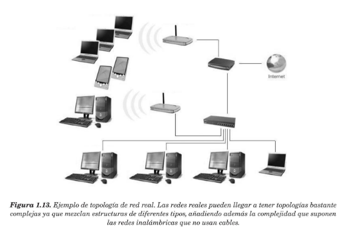

###  **1.2.3.3 Transferencia de la información**  

#### Esta clasificación tiene en cuenta la técnica empleada para transferir la información desde el origen al destino.Por lo tanto, también depende de la topología de la red (existen diferentes topologías que comparten el mismo método de transmisión) .

* #### **Redes conmutadas (punto a punto)** : en este tipo de redes, un equipo origen(emisor) selecciona un equipo con el que quiere conectarse(receptor) y la red es la encargada de habilitar una vía de conexión entre los dos equipos. Normalmente pueden seleccionarse varios caminos candidatos para que esta vía de comunicación que puede o no dedicarse exclusivamente a la misma. Existen tres métodos para la transmisión de la información y la habilitación de la conexión:
    - #### **Conmutación de circuitos** : se establece un camino único dedicado. La ruta que sigue la información se establece durante todo el proceso de comunicación, aunque existan algunos tramos de esa ruta que se comportan con otras rutas diferentes. Una vez finalizada la comunicación, es necesario liberar la conexión. La información que se envia desde el origen/destino e viceversa , es bidereccional .
        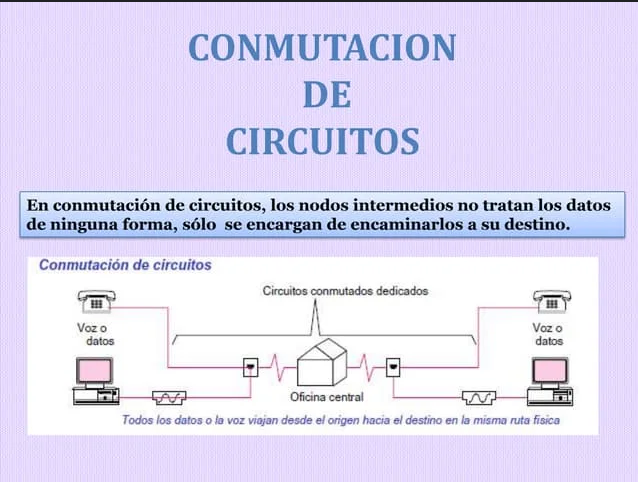
    - #### **Conmutación de paquetes** : el mensaje a enviar se divide en fragmentos/paquetes, cada uno de los cuales es enviado a la red y circula por ésta hasta que llega a su destino.
        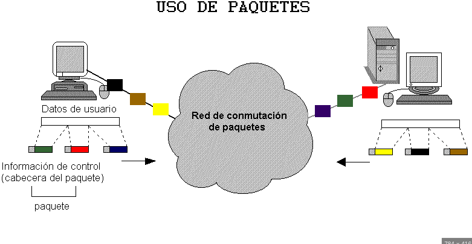
    - #### **Conmutación de mensajes** : la información que envía el emisor se aloja en un único mensaje con la dirección de destiono y se envía al siguiente nodo.
        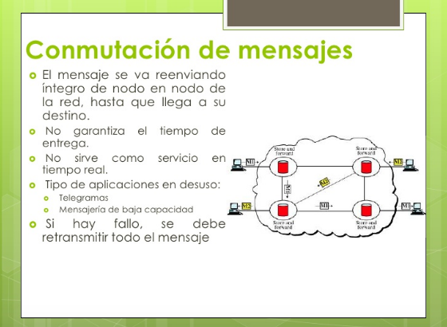

* #### **Redes de difusión (multipunto)**  : un equipo o nodo envía la información a todos los nodos y el destinatario es el encargado de seleccionar y captar esa información. Esta forma de transmisión de la información está condicionada por la topología de la red, ya que ésta se caracteriza por disponer de un único camino o vía de comunicación que debe ser compartido por todos los nodos o equipos(bus,anillo,ondas de radio).
    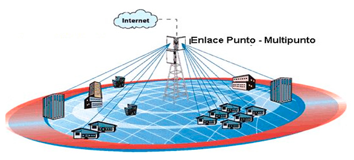
    *REDES CONMUTADAS PUNTO A PUNTO*  
    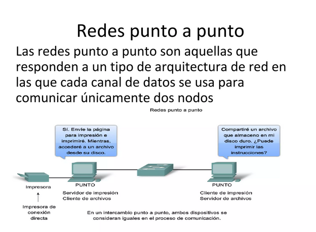 
###  **1.2.3.4 Localización geográfica** 

* #### **Subred o segmento de red** : un segmento de red está formado por un conjunto de estaciones que comparten el mismo medio de transmisión(normalmente están conectadas al mismo cable), es posible montar un segmento de red sin necesidad de utilizar dispositivos conmutadores y reduciendo así el coste de la instalación. Se considera al segmento como la red de comunicación más pequeña, y todas las redes de mayor tamaño están constituidas por la unión de varios segmentos de red.
    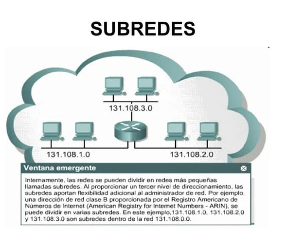

* #### **Red de área local (LAN)**: una LAN es un término vago que se refiere a uno o varios segmentos de red conectados mediante dispositivos especiales. Normalmente se le da este calificativo a redes cuya extensión no sobrepasa el mismo edificio donde esá instalada (o la misma habitación)
    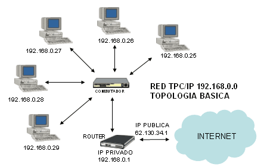

* #### **Red de campus**  : varios edificios dentro de un mismo polígono industrial, que se conectan generalmente a un tendido de cable principal(normalmente,la empresa es propietaria del todo el terreno por el que se extiende el cable y tiene la libertad de poner cuántos cables sean necesarios , sin tener que solicitar permisos especiales)
    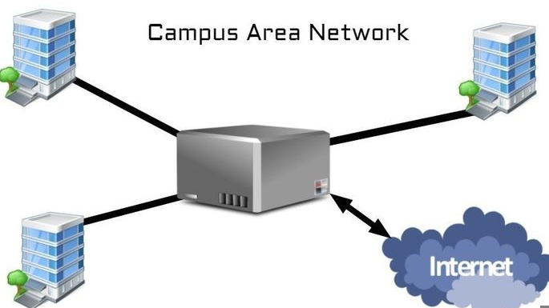
* #### **Red de area metropolitana** (MAN) : una MAN está confinada dentro de una misma ciudad y  se haya sujeta a regulaciones locales. Puede constar de varios recursos públicos o privados, como el sistema de telefonía local, sistemas de microondas locales o cables enterrados de fibra óptica. Una empresa local construye y mantiene la red, y la pone a disposición del  público . Puede conectar sus redes a la MAN y utilizarla para transferir información entre redes de otras ubicaciones de la empresa dentro del área metropolitana.
    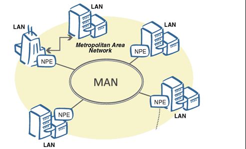

* #### **Red de área extensa (WAN) y redes globales** : las WAN y redes globales abarcan varias ciudades, regiones o paísis. Los enlaces WAN son ofrecidos generalmente por empresas de telecomunicaciones públicas o privadas que utilizan enlaces de microondas,fibra óptica o viá satélite
    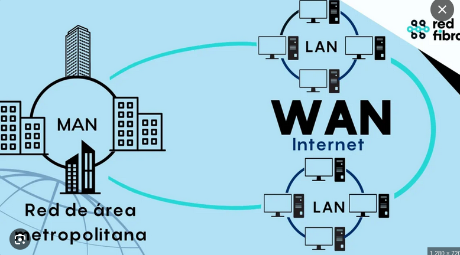

##  **1.2.4 NORMALIZACIÓN Y ORGANISMOS**

### **NORMALIZACIÓN** 

#### La **normalización** es el proceso mediante el cual se establecen normas o estándares para asegurar que productos, servicios, procesos o sistemas sean compatibles, seguros y de calidad uniforme. Su objetivo principal es facilitar la interoperabilidad (que todo funcione bien junto), mejorar la calidad, reducir costos y garantizar la seguridad.

*Por ejemplo, gracias a la normalización: Todos los enchufes y tomas de corriente de un país siguen el mismo formato. Los protocolos de red (como TCP/IP) permiten que cualquier computadora se comunique con otra sin importar el fabricante.*

###  **ORGANISMOS** 

#### Existen varios **organismos** internacionales dedicadas a tareas de normalización y estandarización.

* #### **ISO** [ISO 9000(sistemas de gestión de calidad), ISO 3166(códigos de países),etc.].
* #### **IEEE** [IEEE 802(redes de área local), POSIX(sistemas operativos)]
* #### **W3C** (buscan producir estándares para todas las tecnologías que engloba la *World Wide Web(WWW)*) W3C publica unos documentos oficiales  llamados **Recomendaciones del Consorcio** (HTML,CSS,DOM,XML,etc) que se utilizan para el dseño de páginas web y navegadores en Internet .

* #### **Open Group** (Single UNix Specification).

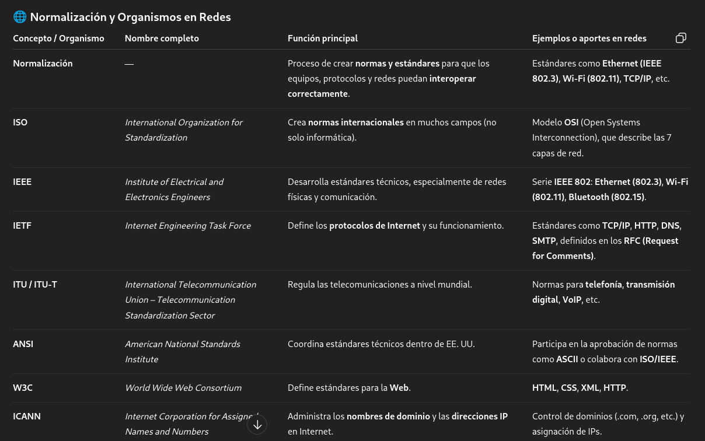

