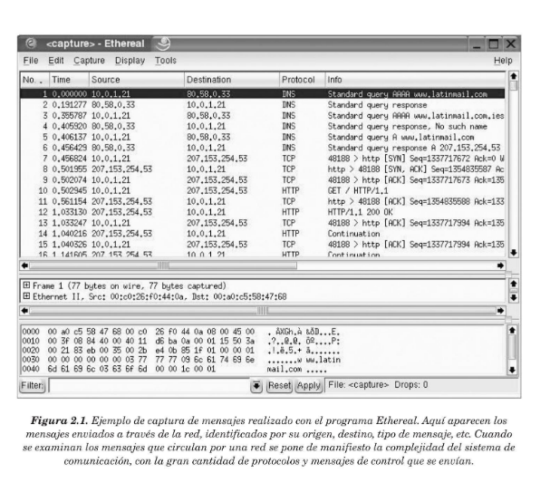
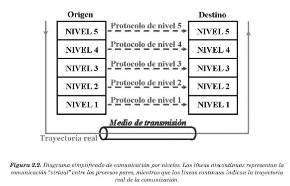
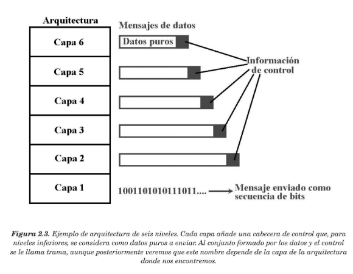
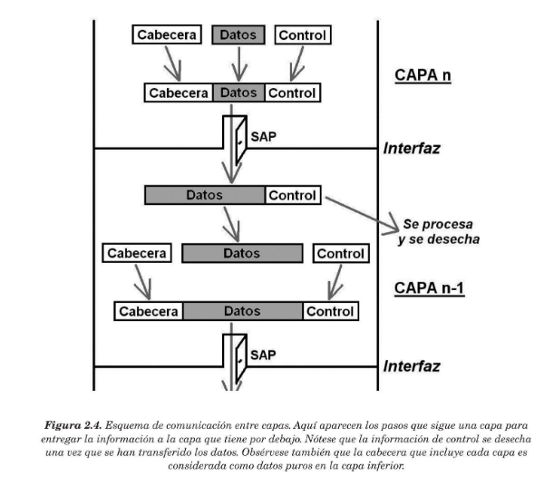

## <span style="color:gold"> **2.1 INTRODUCCIÓN**</span>

#### <span style="color:gold">**software red** </span> : relaliza una gestión eficiente de cara a los recursos físicos de la red(hardware de red) .

#### La <span style="color:gold">**arquitectura de una red** </span> viene definida por tres características fundamentales, que dependen de la tecnología que se utilice en su construcción:

* #### <span style="color:gold">**Topología**</span>: la topología de una red es la organización de su cableado, ya que define la configuración básica de la interconexión de estaciones y, en algunos casos, el camino de una transmisión de datos sobre el cable.

* #### <span style="color:gold">**Método de acceso a la red** </span> : todas las redes que poseen un medio compartido para transmitir la información, necesitan ponerse de acuerdo a la hora de enviar información, ya que no pueden hacerlo a la vez. En este caso,si dos estaciones transmiten a la vez en la misma frecuencia,la señal recogida en los receptores será una mezcla de los dos. Para las redes que no posean un medio compartido, el método de acceso al cable es trivial y no es necesario llevar ningún control para transmitir.

* #### <span style="color:gold">**Protocolos de comunicaciones** </span>: son reglas y procedimientos utilizados en una red para realizar la comunicación.

### <span style="color:gold"> **2.1.1 PROBLEMAS EN EL DISEÑO DE LA ARQUITECTURA DE LA RED** 

#### Algunos de los problemas más importantes a los que se enfrentan los diseñadores de redes de comunicaciones son: 

* #### <span style="color:gold">**Encaminamiento**</span> : cuando existen diferentes rutas posibles entre el origen y el destino(si la red tiene una topología de malla o irregular), se debe elgir una de ellas(normalmente,la más corta o la que tenga un tráfico menor) .

* #### <span style="color:gold">**Direccionamiento**</span> : puesto que una red normalmente tiene muchos ordenadores conectados, algunos de los cuales tienen múltiples procesos (programas), se requiere un mecanismo para que un proceso en una máquina especifique con quién quiere comunicarse. Como consecuencia de tener varios destinos, se necesita alguna forma de direccionamiento que permita determinar un destino específico. Suele ser normal que un equipo tenga asignadas varias direcciones diferentes, relacionadas con niveles diferentes de la arquitectura. En este caso, también habrá que establecer alguna correspondencia entre esas direcciones.

* #### <span style="color:gold"> **Acceso al medio** </span>(mecanismo que controla el orden de transmisión de los interlocutores) : El control de **acceso al medio** en una red es muy similar a una comunicación mediante "*walkie-talkie*" , donde los dos interlocutores deben evitar hablar a la vez o se producirá una **colisión** . Esta situación es indeseable en las redes que usan un medio compartido, ya que los mensajes se mezclan y resulta imposible interpretarlos.

* #### <span style="color:gold">**Saturación del receptor** </span> : consiste en que el emisor rápido pueda saturar a un receptor lento.En determinadas condiciones, el proceso en el otro extremo necesita un tiempo para procesar la información que le llega. Si ese tiempo es demasiado grande en comparación con la velocidad con la que llega la información, será posible que se pierdan datos. Una posible solución a este problema consiste en que el receptor envié un mensaje al emisor indicándole que está listo para recibir más datos.

* #### <span style="color:gold">**Mantenimiento del orden** </span> : algunas redes de transmisión de datos desordenan los mensajes que envían,de forma que,si los mensajes se envían en una secuencia determinada, no se asegura que lleguen en esa misma secuencia. Para solucionar esto, el protocolo debe incorporar un mecanismo que le permita volver a ordenar los mensajes en el destino.

* #### <span style="color:gold">**Control de errores** </span>: todas las redes de comunicación de datos transmiten la información con una pequeña tasa de error, que en ningún caso es nula. Esto se debe a que los medios de transmisión son imperfectos. Tanto emisor como receptor deben ponerse de acuerdo a la hora de establecer que mecanismos se van a utilizar para detectar y corregir errores,y si se va a notificar al emisor que los mensajes llegan correctamente.

* #### <span style="color:gold">**Multiplexación** </span>: en determinadas condiciones, la red puede tener tramos en los que existe un único medio de transmisión que, por cuestiones económicas, debe ser compartido por diferentes comunicaciones que no tienen relación entre sí. Así, el protocolo deberá asegurar que todas las comunicaciones que comparten el mismo medio no se interfieran entre sí.

    

### <span style="color:gold"> **2.1.2 CARACTERÍSTICAS DE LAS ARQUITECTURAS POR NIVELES** </span>

```bash
# Cada nivel es responsable de ofrecer servicios a niveles superiores.
``` 
#### Dentro de cada nivel de la arquitectura coexisten diferentes servicios.Así, los servicios de los niveles superiores pueden elegir cualquiera de los ofrecidos por las capas inferiores,dependiendo de la función que se quiera realizar. A la arquitectura por niveles también se le llama **jerarquía de protocolos**.

#### En una jerarquia de protocolos se siguen las siguientes reglas: 

* #### Cada nivel dispone de un conjunto de servicios.
* #### Los servicios están definidos mediante protocolos estándares.
* #### Cada nivel se comunica solamente con el nivel inmediato superior y con el inmediato inferior.
* #### Cada uno de los niveles inferiores proporciona servicios a su nivel superior

#### Cuando se comunican dos ordenadores que utilizan la misma arquitectura de red, los protocolos que se encuentran al mismo nivel de la jerarquía deben coordinar el proceso de comunicación.

#### En general, el nivel n de una máquina se comunica de forma inderecta con el nivel n homónimo de la otra máquina. Las reglas  y convenciones usadas en esa comunicación se conocen como **protocolo de nivel n** . A los elementos activos de cada capa se les llama **entidades o procesos** y son éstos los que se comunican mediante el uso del protocolo. Al grupo formado por las entidades o procesos en máquinas diferentes que están al mismo nivel se le llama **entidades pares o procesos pares** 



#### El modelo de arquitectura po niveles necesita *información adicional* para que los procesos pares puedan comunicarse a un determinado nivel. Estos datos adicionales dependen del protocolo utilizado y sólo se conoce su verdadero significado a ese nivel;normalmente, los niveles inferiores los tratan como si fuera información propiamente dicha. A ese añadido se le llama generalmente **cabecera** o **información de control** y suele ir al principio y/o al final del mensaje.

```bash
# La última capa no suele añadir información adicional ya que se encarga de enviar los dígitos binarios por el cable
```



#### En una arquitectura de red, las entidades de la capa *n* implementan un determinado servicio que usa la capa capa *n+1* (que se encuentra por encima). En este caso, la capa *n* se llama **proveedor del servicio** y la capa *n+1* es el **usuario del servicio**. La capa *n*, a su vez, puede usar los servicios de la capa *n-1* y,en ese caso, la capa *n* sería la usuaria del servicio y la capa *n-1* proveedor del servicio. Es posible que la capa *n* pueda ofrecer diferentes clases de servicios y será la capa *n+1* (usuario del servicio) la que seleccione cuál quiere usar (haciendo la llamada al servicio correspondiente).

#### A los servicios de una capa se accede  a través de un **SAP** (Service Access Point). Los SAP de la capa *n* son las "puertas" por las que las entidades de la capa *n+1* tienen acceso a los servicios e intercambian información. Cada SAP es como una dirección o punto de entrada y, normalmente, es un número que lo identifica de manera única .

#### Cuando una entidad de la capa *n* desea enviar información a su entidad par de la otra máquina , lo que hace es llamar al servicio correspondiente de la capa inferior a ésta(n-1), entregándole los datos que desea enviar. Esta llamada se realiza a través del punto de acceso del servicio y,normalmente,está definida por un conjunto de reglas que hay que cumplir,llamadas **interfaz**.





