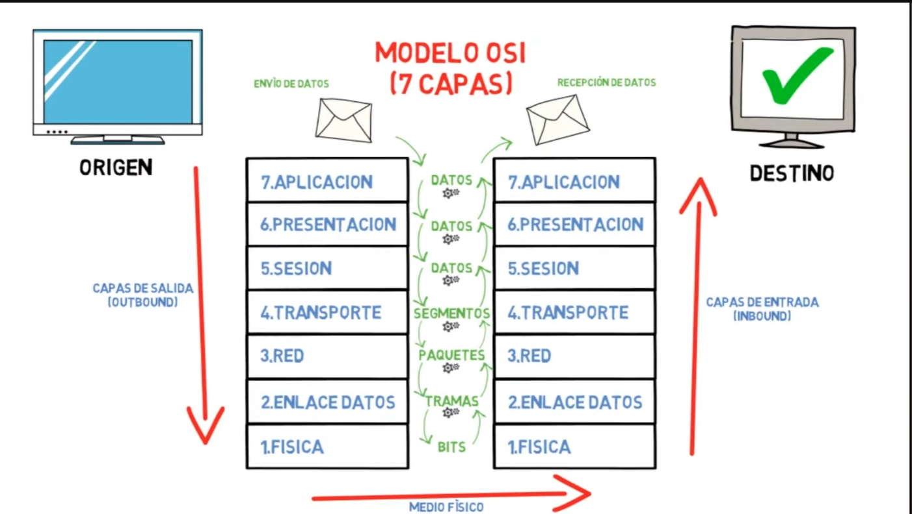
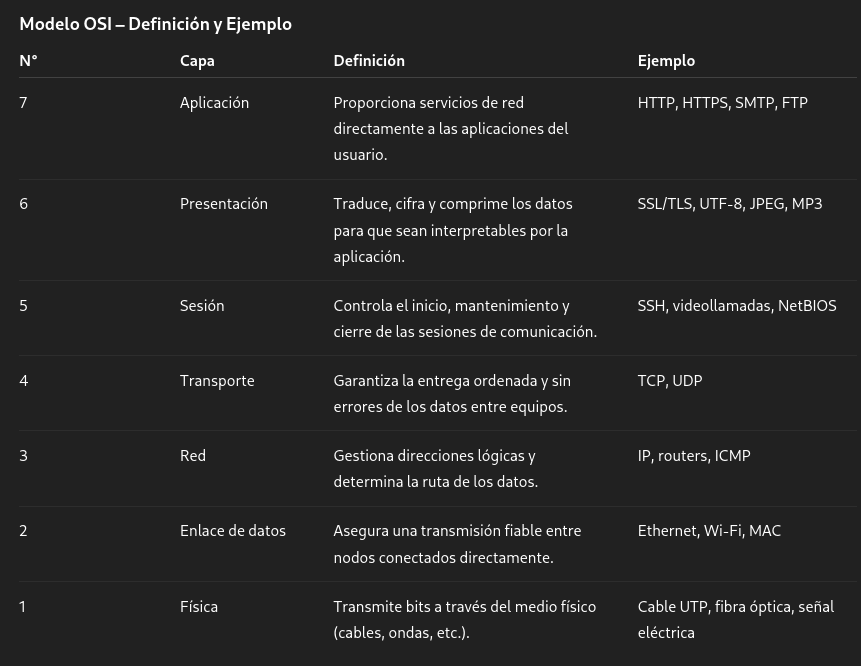
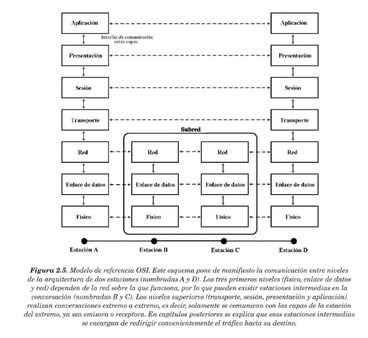
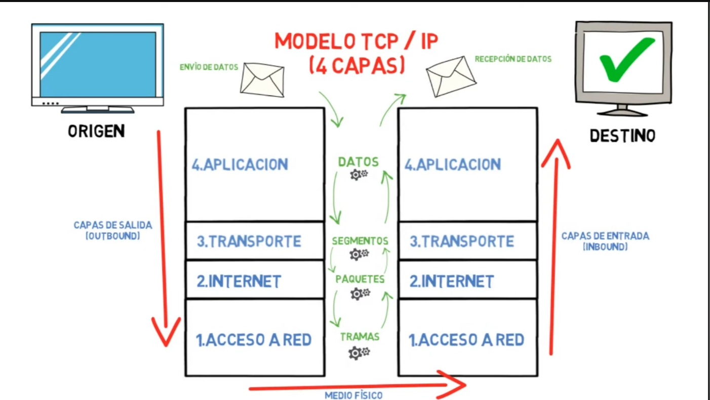
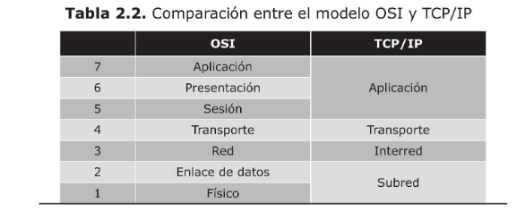
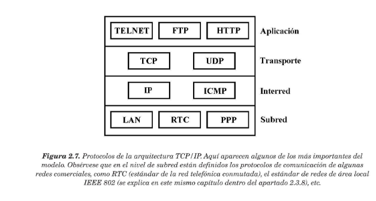
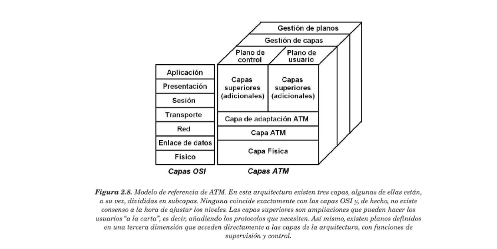
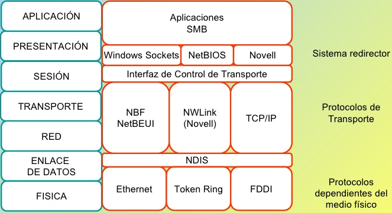

##  **2.2 EJEMPLOS DE ARQUITECTURAS DE REDES** 

#### A continuación se verán los modelos más utilizados para redes de ordenadores

###  **2.2.1 MODELO DE REFERENCIA OSI** 

#### **El modelo OSI**, perteneciente a la organización **ISO** , emplea una arquitectura en niveles a fin de dividir los problemas de interconexión en partes manejables.

#### **El modelo OSI** está definido más bien como modelo, y no como arquitectura. La razón principal es que la ISO definió solamente la función general que debe realizar cada capa. pero no mencionó en absoluto los servicios y protocolos que se deben usar en cada una de ellas. Esto quiere decir que, al contrario que el resto de arquitecturas de redes, el modelo 0SI se definió antes de que se diseñaran los protocolos.

#### La funciones encomendadas a cada una de las capas de OSI son las siguientes : 

* #### **1. Nivel físico**  : tiene que ver con la transmisión de dígitos binarios por un canal de comunicación . Las consideraciones de diseño tienen que ver con el propósito de asegurarse de que, cuando un lado envíe un "1" , se reciba en el otro lado como "1", no como "0" .

* #### **2. Nivel de enlace**  : su tarea principal es detectar y corregir todos los errores que se produzcan en la línea de comunicación. También se encarga de controlar que un emisor rápido no sature a un receptor lento, ni se pierdan datos innecesariamente. Finalmente, en redes donde existe un único medio compartido por el que circula la información, este nivel se encarga de repartir su utilización entre las estaciones. La unidad mínima de datos que se transfiere entre  entidades pares a este nivel se llama **trama** o **marco** .

* #### **3. Nivel de red**  : se ocupa de determinar cuál es la mejor ruta por la que enviar la información. La capa de red debe controlar también la congestión de la red, intentando repartir la carga lo más equilibrada posible entre las distintas rutas. También a este nivel se realiza gran parte del trabajo de convertir y adaptar los mensajes que circulan entre redes heterogéneas.La unidad mínima de información que se transfiere a este nivel se llama **paquete**.

* #### **4. Nivel de transporte**  : es el nivel más bajo que tiene independencia total del tipo de red utilizada y su función básica es tomar los datos procedentes  del nivel sesión  y pasarlos a la capa de red, asegurando que lleguen correctamente al nivel de sesión del otro extremo. A este nivel, la conexión es realmente de extremo a extremo , ya que no se establece ninguna conversación con los niveles de transporte de todas las máquinas intermedias

* #### **5. Nivel de sesión**  : se establecen sesiones(conexiones) de comunicación entre los dos extremos para el transporte ordinario de datos.

* #### **6. Nivel de presentación**  : a este nivel se controla el significado de la información que se transmite, lo que permite la traducción/conversión  de los datos entre las estaciones.  

* #### **7. Nivel de aplicación**  : es el nivel que está en contacto directo con los programas o aplicaciones informáticas de las estaciones y contiene los servicios de comunicación más utilizados en las redes. 

    

    

###  **2.2.2 ARQUITECTURA TCP/IP**

#### **TCP/IP** , es la arquitectura de red más utilizada del mundo, ya que es la base de comunicación de Internet y también se utiliza ampliamente en las distintas versiones de los sistemas operativos Unix, Linux y Windows .

#### La arquitectura TCP/IP se construyó diseñando inicialmente los protocolos para,posteriormente,integrarlos por capas en la arquitectura. Por está razón, a TCP/IP muchas veces se le califica como *pila de protocolos* .

* ####  **1. Capa de subred**  : el modelo no da mucha información de esta capa y solamente se especifica que debe existir algún protocolo que conecte la estación con la red. 

* ####  **2. Capa de interred**  : esta capa es la más importante de la arquitectura y su misión consiste en permitir que las estaciones envién información (paquetes) a la red y los hagan viajar de forma independiente hacia su destino. Durante este viaje, los paquetes pueden atravesar redes diferentes y llehar desordenados. Esta capa no se responsabiliza de la tarea de ordenar de nuevo los mensajes en el destino. El protocolo más impotante de esta capa se llama **IP** , aunque también existen otros protocolos.

* ####  **3. Capa de transporte**  : ésta cumple la función de establecer una conversación entre el origen y el destino, de igual forma que hace la capa transporte en el modelo OSI. Puesto que las capas inferiores no se responsabilizan del control de errores ni de la ordenación de los mensajes,ésta debe realizar todo ese trabajo. Aquí también se han definido varios protocolos, entre los que destacan **TCP**(orientado a la conexión y fiabilidad) y **UDP** (no orientado a la conexión y fiabilidad) .

* ####  **4. Capa de aplicación**  : esta capa contiene, al igual que la capa de aplicación de OSI, todos los protocolos de alto nivel que utilizan los programas para comunicarse. Aquí se encuentra el protocolo de terminal virtual (TELNET), el de transmisión de archivo (FTP) , el protocolo HTTP (web) , SMTP (correo electrónico),etc.

    

###  **2.2.3 ATM** 

#### La red ATM se basa en la transmisión de bloques de información de tamaño fijo llamados celdas o células

* ####  **1. Capa física**  : está relacionada directamente con la red y el medio de transmisión. Al igual que la capa de subred de TCP/IP,ATM no establece un conjunto de reglas en particular, sino  que solamente dice que la información a este nivel puede transmitirse utilizando el protocolo de comunicación de la red sobre la que funcione

* ####  **2. Capa ATM**  : es responsable del transporte de las celdas por la red y del establecimiento y liberación de las conexiones. También se encarga de decidir la ruta que van a seguir las celdas y del control de la congestión.

* ####  **3. Capa de adaptación ATM**  : es la encargada de dividir toda la información que se va a transmitir en celdas y resamblarla en el otro extremo.

#### dentro de los planos que se definen en tercera diminsión podemos encontrar : **plano de usuario** (se centra en las tareas a nivel usuario) **plano de control** (administración de la conexión) **planos de gestión**(administración de los recursos y coordinación de las capas)

###  **2.2.4 RED MICROSOFT** 

#### **SMB** : Es el corazón del uso compartido de archivos e impresoras en Windows.Permite acceder a carpetas de red, montar unidades compartidas y manejar permisos. Las versiones modernas (SMB 3.x) incluyen mejoras de seguridad como cifrado y firma digital.

#### **NetBIOS/NetBEUI (históricos)** : Fueron muy usados en versiones antiguas de Windows para la resolución de nombres y descubrimiento de equipos. Aunque siguen existiendo por compatibilidad, hoy están prácticamente reemplazados por protocolos más modernos.

