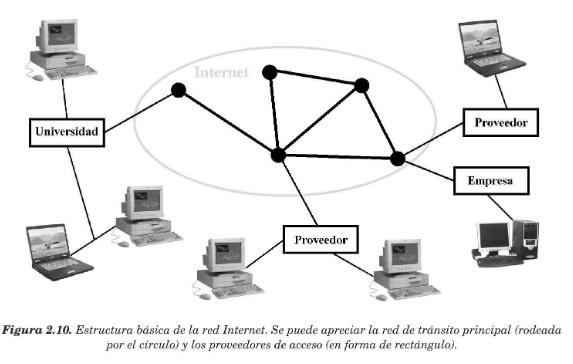
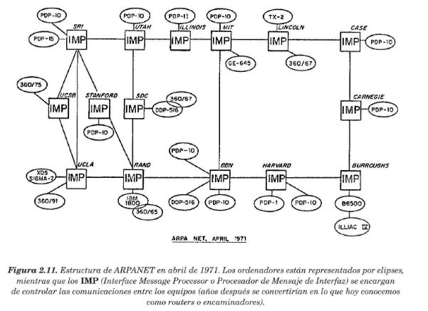
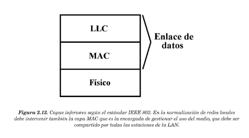
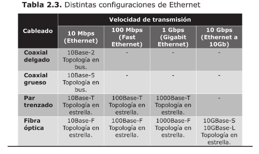
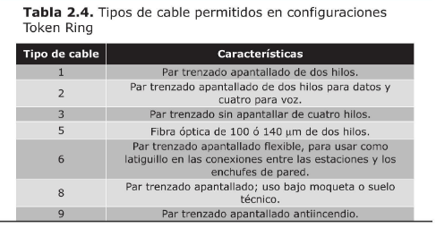
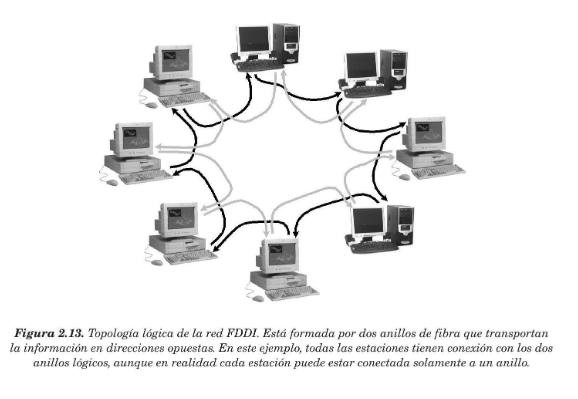
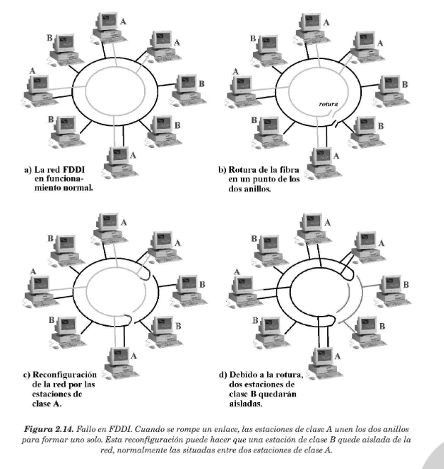

## <span style="color:gold"> **2.3 EJEMPLOS DE REDES DE TRANSMISIÓN DE DATOS** </span>

### <span style="color:gold"> **2.3.1 RED TELEFÓNICA CONMUTADA (RTC)** </span>

#### La **Red Telefónica Conmutada(RTC)** está destinada a la transmisión de voz a través de corriente eléctrica que circula por un hilo conductor paralelo. Inicialmente se trataba de una red conmutada manualmente por operadora, que se encargaba de establecer la conexión entre los diferentes abonados. Más adelante, cuando el número de usuarios desbordó este sistema, se concibió la idea de dotar a cada abonado de un número personal que permitiera la distinción del resto, además de la implementación de centralitas automáticas, capaces de establecer la conexión entre dos abonados sabiendo sus direcciones numéricas.

#### El principal servicio ofrecido por la red telefónica conmutada es la transmisión de voz en tiempo real,además de la tarificación por pasos .

### <span style="color:gold"> **2.3.2 TÉLEX** </span>

#### El **télex es un servicio público ya en desuso para la comunicación de información textual en forma de mensajes. Es responsabilidad de la Dirección General de Correos y Telégrafos y consta,en esencia,de una red de transmisión independiente mediante la cual se facilita la intercomunicación de abonados a través de líneas especiales télex y de centrales telegráficas de conmutación .

### <span style="color:gold"> **2.3.3 IBERPAC** </span>

#### **Iberpac** es una red de transmisión de datos extendida por toda la geografía española. Actaulmente se está restringiendo su uso a ciertas comunicaciones, como las sucursales bancarias y los cajeros automáticos. 

#### Iberpac se basa en el conjunto de protocolos de comunicaciones **X.25** , desarrollado en 1970 por el CCITT que establece una serie de normas par la comunicación en redes de área extensa.


### <span style="color:gold"> **2.3.4 RED DIGITAL DE SERVICIOS INTEGRADOS** </span>

#### El estándar **RSDI** surgió en 1984 como una solución a las necesidades de comunicación modernas. RDSI ofrece todo tipo de servicios : transmisión de voz , transmisión de datos, transmisión de imagen y sonido en tiempo real, etc.

#### La red RDSI dispone de su propio cableado, se utiliza como red de área extensa y no puede funcionar sobre las redes telefónicas estándar (RTC). Además, esta red dispone de servicios a velocidades y capacidades diferentes, dependiendo del contrato que realice el usuario.

#### La arquitectura de RSDI define los protocolos de la red a nivel físico, enlace de datos y red y, si un usuario cambia su instalación de RTC a RDSI, necesitará de unos adaptadores especiales para que sus dispositivos propios funcionen. Así mismo, también se ofrecen terminales especiales para su uso en RDSI


### <span style="color:gold"> **2.3.5 INTERNET** </span>

#### **Internet** es una red mundial de ordenadores formada por multitud de pequeñas redes y de ordenadores individuales conectados unos a otros de forma que sea posible el intercambio de información entre ellos. El éxito de Internet se basa en que se puede considerar como una única entidad,es decir, que es posible tomar información de otros sistemas como si estuviesen al lado.

#### Las redes de Internet pueden dividirse en tres clases:

* ####  <span style="color:gold">**Redes de tránsito o transporte internacional**</span> : garantizan la interconexión de las diferentes redes de proveedores de la conexión.

* ####  <span style="color:gold">**Redes regionales y de proveedores de conexión** </span> : garantizan la conectividad entre el usuario final y las redes de tránsito.

* ####  <span style="color:gold">**Redes de usuario final**</span> : van desde una simple conexión de un ordenador hasta redes corporativas privadas de una empresa (LAN)




```bash
# ARPA ( departamento encargado a manejar la gran vulnerabilidad que sufrñian las redes de comunicación)
# ARPANET (conexión de nuevos ordenadores y cableado a la red)
# NCP (protocolo control de red)
# TCP (versión mejorada de NCP)
# TCP/IP (Protocolo de Control de Transmisión)
```


### <span style="color:gold"> **2.3.6 LÍNEA DIGITAL DE SUSCRIPTOR**

#### Las tecnologías  <span style="color:gold">**DSL**</span>(Digital Subscriber Line) está basada en la idea de utilizar la red telefónica básica (RTC) para transmitir información a alta velocidad. Una variante de estas redes es  <span style="color:gold">**ADSL** </span> (Asymetric Digital Subscriber Line) y se llama asimétrica porque,por cuestiones técnicas, la velocidad de transmisión en un sentido es menor que en otro . Como contrapartida, también esxisten las líneas  <span style="color:gold">**SDSL** </span> (Symetric Digital Subscriber Line), donde la comunicación se realiza a la misma velocidad en ambos sentidos.


### <span style="color:gold"> **2.3.7 REDES DE CABLE**

#### Se le llama genéricamente  <span style="color:gold">**redes de cable**</span> a todas aquellas redes de comunicación diseñadas inicialmente para la distribución de señales de televisión por cable. Las redes de cable utilizan cable coaxial hasta los hogares y fibra óptica en las conexiones de gran capacidad. Hoy en día, estas redes también ofrecen otros servicios, como la transmisión de voz y datos y posiblemente a futuro fibra óptica . 

#### La redes por cable requieren grandes inversiones económicas para su instalación.

### <span style="color:gold"> **2.3.8 REDES LOCALES** </span>

#### Las redes locales utilizan diferentes protocolos de nivel físico y nivel de enlace de datos, mientras que por los niveles superiores se utilizan las arquitecturas de redes aprendidadas anteriormente . Entre las redes locales más importantes podemos destacar (Ethernet,Token Ring,FDDI,100VG-AnyLAN).

#### <span style="color:gold"> **ETHERNET** </span>

####  <span style="color:gold">**Ethernet** </span>se adaptó al estándar  <span style="color:gold">**IEEE 802.3**</span> , que fue elaborado por la organización IEEE para la comunicación en redes locales . Dentro de este estándar se han definido varios tipos de redes locales en lo que se refiere al tipo de cableado utilizado,velocidad de transmisión,formato de los bloques de información,etc. Estos aspectos están definidos a nivel físico y a nivel enlace, por lo que IEEE 802 sólo cubre los protocolos de estas dos capas .

#### IEEE 802 está dividido en varias especificaciones diferentes :

* #### **IEEE 802.1** : niveles superiores (nivel de red).
* #### **IEEE 802.2** : se encuentra normalizada la parte superior del nivel enlace (LLC)

* #### **IEEE 802.3 - IEEE 802.12** : parte inferior del nivel enlace (MAC) .

#### Cada una de ellas establece un tipo de LAN diferente, que resultan incompatibles entre sí.






#### <span style="color:gold"> **TOKEN RING** </span> 

#### **Token Ring** es otro popular método para conectar redes locales, aunque su uso está reduciendo en estos últimos años en favor del estándar Ethernet . Su principal característica es que, aunque utiliza una topología en forma de estrella , ésta funciona como una estructura lógica en anillo . Esto se consigue gracias a la utilización de un concentrador de cableado llamado **MAU** (Unidad de Acceso MUltiestación) como nodo central de la estrella .



####  <span style="color:gold"> **100VG-AnyLAN** </span>

#### El estándar **100VG-AnyLAN** para redes locales está basado en las especificaciones a nivel físico y nivel de enlace de datos inicialmente definidas por AT&T y Hewlett-Packard, aunque posteriormente se establecieron en la norma IEEE 802.12.

#### 100VG-AnyLAN utiliza la topología en estrella , con concentradores de cableado, al igual que las redes Ethernet  10BASE-T y 100BASE-T y la velocidad de transmisión es de 100 Mbps . Sin embargo, las características que diferencian este tipo de red local con Ethernet son :

* #### Utiliza concentradores de cableado específico

* #### Se pueden montar tres niveles en cascada de concentradores.

* #### Las longitudes de los cables son mayores: 100 metros para cables de categoría 3 y 150 metros para cables de categoría 5.

* #### Cada puerto del concentrador puede configurarse para recibir solamente datos que van hacia la estación que está conectada a éste o para recibir todos los datos enviados por todas las estaciones.

* #### Gestiona el acceso al medio mediante un protocolo más eficiente, llamado prioridad de petición, desde el concentrador es el encargado de establecer qué estación debe transmitir.


####  <span style="color:gold"> **FDDI** </span>

#### Ls red <span style="color:gold">**FDDI**</span> (Interfaz de Datos Distribuido por Fibra) fue diseñada con el propósito de obtener una red de alta velocidad, alta capacidad y gran fiabilidad.Así, es capaz de transferir información entre 50 y 100MBps y permite la conexión de hasta 1000 estaciones.




#### FDDI utiliza fibras multimodo para los enlaces,además de concentradores de cableado, lo que confiere una topología física en estrella. La fiabilidad de la tecnología de fibra le da a esta red una tasa de fallos inferior a un dígito binario por cada 10.000 millones. Otra característica que hace a FDDI muy fiable es su topología lógica en forma de doble anillo, donde la información gira en direcciones opuestas. Si alguna de las estaciones falla o se rompe el cable de algún punto(rompiendo los dos anillos), será posible unirlos formando un solo anillo de doble lingitud y la red continuará funcionando. Cada estación dispone de un mecanismo para unir los dos anillos o saltar esa estación si no funciona.

#### A los anillos de la red se les llama <span style="color:gold">**anillo primario**</span> y <span style="color:gold">**anillo secundario** </span>. Tambiém existen dos clases de estaciones: las de <span style="color:gold">**clase A</span>(DAS)**, conectadas al anillo primario y secundario, y las <span style="color:gold">**clase B</span>(SAS)**, solamente conectadas al anillo primario. Si se produce un fallo, serán las estaciones de clase A(DAS) las que reconfiguren el anillo, y alguna de las estaciones de clase B puede quedar aislada.Esta desventaja se compensa con el hecho de que las estaciones de clase B sólo tienen una conexión a la red y,por lo tanto,los costes se reducen. Será responsabilidad del administrador de la red establecer qué estaciones son más importantes y deben conectarse a los dos anillos.



#### Existe un estándar prácticamente idéntico a FDDI llamdo **CDDI** o **TPDDI** que se diferencia del anterior en que utiliza cable de cobre en vez de fibra óptica, aunque la topología,configuración y formatos de bloques de información que transmiten son iguales.

#### <span style="color:gold"> **REDES LOCALES INALÁMBRICAS** </span>

#### Las **redes locales inalámbricas**(estándar IEEE 802.11), se clasifican como LAN, ya que habitualmente se instalan dentro del ámbito de un edificio. Su topología está distribuida en emisores y receptores de ondas de radio que están conectadas entre sí y dispersados por toda la organización. De esta forma, cualquier equipo que disponga también de un emisor y receptor estará permanente  conectado en cualquier lugar, sin necesidad de utilizar cables.

### <span style="color:gold"> **2.3.9 COMUNICACIONES MEDIANTE CABLE ELÉCTRICO**

#### Los sistemas <span style="color:gold">**PLC** </span>(Comunicaciones por Líneas Eléctricas) están basados en tecnologías que permiten transmitir señales de datos a través de las líneas de enrgía eléctrica de baja tensión.

#### Cada equipo que se desee conectar a una red PLC debe a su vez conectarse con un módem PLC enganchado a la red eléctrica. Este módem PLC es el encargado de modular y adaptar las señales para que circulen por los cables eléctricos de la instalación. El número máximo de módem PLC que se pueden conectar a la red eléctrica para que intercambien información es 256. 


#### <span style="color:gold">**BPL**</span>(Banda Ancha sobre Líneas Eléctricas) , permite transmitir señales digitales a través de líneas de energía de alta tensión a largas distancias.Gracias a esta tecnología, muchas zonas remotas y aisladas pueden tener acceso a redes de área extensa como Internet.


